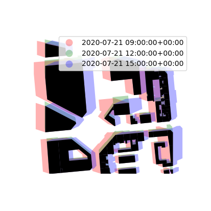
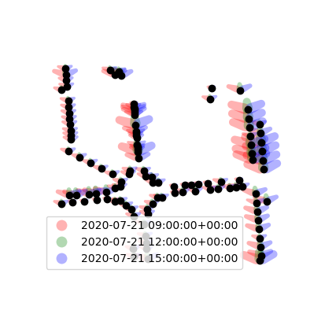

# Urban bioclimatic shape analysis
## Sky View Factor
## Ground shadows

Some of the following features are implemented in [(Leduc et al.,
2021)](https://hal.archives-ouvertes.fr/hal-03368426/document){target=_blank}.

### Ground shadows of buildings

The aim here is to determine the ground shadows of buildings
assimilated to a collection of straight prisms. To do this, the
GeoDataFrame of the building footprints (polygonal footprints
completed with a height attribute name) and a set of dates are
provided to the *t4gpd.sun.STHardShadow* class. This double
information makes it possible to determine the layout of the shadows
of the buildings, the latitude being recovered from the centroid of
the zone of the buildings.

> `STHardShadow(occludersGdf, datetimes, occludersElevationFieldname='HAUTEUR',`
> `altitudeOfShadowPlane=0, aggregate=False, tz=None, model='pysolar')`

```python
from datetime import datetime, timedelta
from t4gpd.commons.DatetimeLib import DatetimeLib
from t4gpd.demos.GeoDataFrameDemos import GeoDataFrameDemos
from t4gpd.sun.STHardShadow import STHardShadow

buildings = GeoDataFrameDemos.ensaNantesBuildings()

datetimes = [datetime(2020, 7, 21, 9), datetime(2020, 7, 21, 15), timedelta(hours=3)]
datetimes = DatetimeLib.generate(datetimes)
shadows = STHardShadow(buildings, datetimes, occludersElevationFieldname='HAUTEUR',
	altitudeOfShadowPlane=0, aggregate=True, tz=None, model='pysolar').run()
```

To map it via matplotlib, proceed as follows:

```python
import matplotlib.pyplot as plt
from matplotlib.colors import ListedColormap

my_cmap = ListedColormap(['red', 'green', 'blue'])

_, basemap = plt.subplots(figsize=(0.5 * 8.26, 0.5 * 8.26))
shadows.plot(ax=basemap, column='datetime', cmap=my_cmap, alpha=0.3, legend=True)
buildings.plot(ax=basemap, color='black')
plt.axis('off')
plt.savefig('img/shadows1.png')
```



### Tree shadows

In order to plot the ground shadows caused by trees, we implemented
two distinct tree models. The first one is a model for which the tree
crown is spherical. It corresponds to the class
*t4gpd.sun.STTreeHardShadow*. The second is a model for which the tree
crown is a conical frustum (i.e. possibly a cyclinder). It corresponds
to the class *t4gpd.sun.STTreeHardShadow2*.

#### Shadows cast by trees with spherical crowns

Ground shadows caused by trees with spherical crowns are ellipses. The
*t4gpd.sun.STTreeHardShadow* class is used to draw their contours.

> `STTreeHardShadow(treesGdf, datetimes, treeHeightFieldname, treeCrownRadiusFieldname,`
> `altitudeOfShadowPlane=0, aggregate=False, tz=None, model='pysolar', npoints=32)`

We start here by establishing an arbitrary correspondence map, named
TREES, between the height estimate (an interval stored as a string)
and the total height on the one hand and the radius of the cylindrical
crown on the other hand.

```python
from datetime import datetime, timedelta
from t4gpd.commons.DatetimeLib import DatetimeLib
from t4gpd.demos.GeoDataFrameDemos import GeoDataFrameDemos
from t4gpd.sun.STTreeHardShadow import STTreeHardShadow

TREES = {
	'0-5 m':   {'height': 5.0,  'radius': 2.0},
	'6-10 m':  {'height': 8.0,  'radius': 3.0},
	'11-15 m': {'height': 13.0, 'radius': 4.0},
	'16-20 m': {'height': 18.0, 'radius': 6.0},
	'Z.N.R':   {'height': 10.0, 'radius': 3.0},
	'21-30 m': {'height': 25.5, 'radius': 8.0}
}

trees = GeoDataFrameDemos.ensaNantesTrees()
trees['height'] = trees.hauteur.apply(lambda h: TREES[h]['height'])
trees['radius'] = trees.hauteur.apply(lambda h: TREES[h]['radius'])

datetimes = [datetime(2020, 7, 21, 9), datetime(2020, 7, 21, 15), timedelta(hours=3)]
datetimes = DatetimeLib.generate(datetimes)
shadows = STTreeHardShadow(trees, datetimes, treeHeightFieldname='height',
	treeCrownRadiusFieldname='radius',  altitudeOfShadowPlane=0, 
	aggregate=True, tz=None, model='pysolar', npoints=32).run()
```

To map it via matplotlib, proceed as follows:

```python
import matplotlib.pyplot as plt
from matplotlib.colors import ListedColormap

my_cmap = ListedColormap(['red', 'green', 'blue'])

_, basemap = plt.subplots(figsize=(0.5 * 8.26, 0.5 * 8.26))
shadows.plot(ax=basemap, column='datetime', cmap=my_cmap, alpha=0.3, legend=True)
trees.plot(ax=basemap, color='black')
plt.axis('off')
plt.savefig('img/shadows2.png')
```


#### Shadows cast by trees with conical frustum-like crowns

> `STTreeHardShadow2(treesGdf, datetimes, treeHeightFieldname, treeCrownHeightFieldname,`
> `treeUpperCrownRadiusFieldname, treeLowerCrownRadiusFieldname, altitudeOfShadowPlane=0,`
> `aggregate=False, tz=None, model='pysolar', npoints=32)`


We start here by establishing an arbitrary correspondence map, named
TREES, between the height estimate (an interval stored as a string)
and the total height on the one hand and the radius of the cylindrical
crown on the other hand.

```python
from datetime import datetime, timedelta
from t4gpd.commons.DatetimeLib import DatetimeLib
from t4gpd.demos.GeoDataFrameDemos import GeoDataFrameDemos
from t4gpd.sun.STTreeHardShadow2 import STTreeHardShadow2

TREES = {
	'0-5 m':   {'height': 5.0,  'crown_height': 2.0,  'radius': 2.0},
	'6-10 m':  {'height': 8.0,  'crown_height': 5.0,  'radius': 3.0},
	'11-15 m': {'height': 13.0, 'crown_height': 9.0,  'radius': 4.0},
	'16-20 m': {'height': 18.0, 'crown_height': 14.0, 'radius': 6.0},
	'Z.N.R':   {'height': 10.0, 'crown_height': 6.0,  'radius': 3.0},
	'21-30 m': {'height': 25.5, 'crown_height': 21.0, 'radius': 8.0}
}

trees = GeoDataFrameDemos.ensaNantesTrees()
trees['height'] = trees.hauteur.apply(lambda h: TREES[h]['height'])
trees['crown_height'] = trees.hauteur.apply(lambda h: TREES[h]['crown_height'])
trees['crown_radiusL'] = trees.hauteur.apply(lambda h: TREES[h]['radius'])
trees['crown_radiusU'] = trees.hauteur.apply(lambda h: TREES[h]['radius']-1.5)

datetimes = [datetime(2020, 7, 21, 9), datetime(2020, 7, 21, 15), timedelta(hours=3)]
datetimes = DatetimeLib.generate(datetimes)
shadows = STTreeHardShadow2(trees, datetimes, treeHeightFieldname='height',
	treeCrownHeightFieldname='crown_height',
	treeUpperCrownRadiusFieldname='crown_radiusU', 
	treeLowerCrownRadiusFieldname='crown_radiusL',
	altitudeOfShadowPlane=0, aggregate=False, tz=None, model='pysolar', npoints=32).run()
```

To map it via matplotlib, proceed as follows:

```python
import matplotlib.pyplot as plt
from matplotlib.colors import ListedColormap

my_cmap = ListedColormap(['red', 'green', 'blue'])

_, basemap = plt.subplots(figsize=(0.5 * 8.26, 0.5 * 8.26))
shadows.plot(ax=basemap, column='datetime', cmap=my_cmap, alpha=0.3, legend=True)
trees.plot(ax=basemap, color='black')
plt.axis('off')
plt.savefig('img/shadows3.png')
```



<!--
## Comfort Indexes
### Mean radiant temperature

```python
from t4gpd.comfort.MeanRadiantTemperature import MeanRadiantTemperature
from t4gpd.morph.geoProcesses.STGeoProcess import STGeoProcess

op = MeanRadiantTemperature(measuresGdf)
mrtGdf = STGeoProcess(op, measuresGdf).run()
```

### Empirical Thermal Indexes

```python
from t4gpd.comfort.EmpiricalThermalIndexes import EmpiricalThermalIndexes
from t4gpd.morph.geoProcesses.STGeoProcess import STGeoProcess

measuresGdf['TC_mean'] = (measuresGdf['Temp_C_Avg(1)'] + measuresGdf['Temp_C_Avg(2)']) / 2.0

op = EmpiricalThermalIndexes(measuresGdf, AirTC='TC_mean')
etiGdf = STGeoProcess(op, measuresGdf).run()
```

### Linear Thermal Indexes

```python
from t4gpd.comfort.LinearThermalIndexes import LinearThermalIndexes
from t4gpd.morph.geoProcesses.STGeoProcess import STGeoProcess

measuresGdf['TC_mean'] = (measuresGdf['Temp_C_Avg(1)'] + measuresGdf['Temp_C_Avg(2)']) / 2.0

op = LinearThermalIndexes(measuresGdf, AirTC='TC_mean')
ltiGdf = STGeoProcess(op, measuresGdf).run()
```

### Universal Thermal Indexes

```python
from t4gpd.comfort.MeanRadiantTemperature import MeanRadiantTemperature
from t4gpd.comfort.UniversalThermalIndexes import UniversalThermalIndexes
from t4gpd.morph.geoProcesses.STGeoProcess import STGeoProcess

measuresGdf['TC_mean'] = (measuresGdf['Temp_C_Avg(1)'] + measuresGdf['Temp_C_Avg(2)']) / 2.0

op1 = MeanRadiantTemperature(measuresGdf)
mrtGdf = STGeoProcess(op1, measuresGdf).run()

op2 = UniversalThermalIndexes(mrtGdf, AirTC='TC_mean')
mrtUtiGdf = STGeoProcess(op2, mrtGdf).run()
```
-->