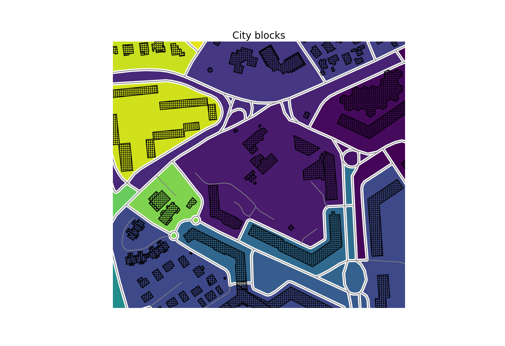
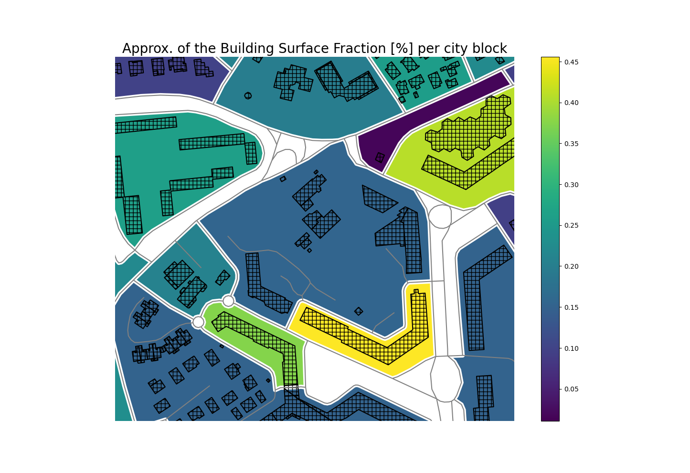
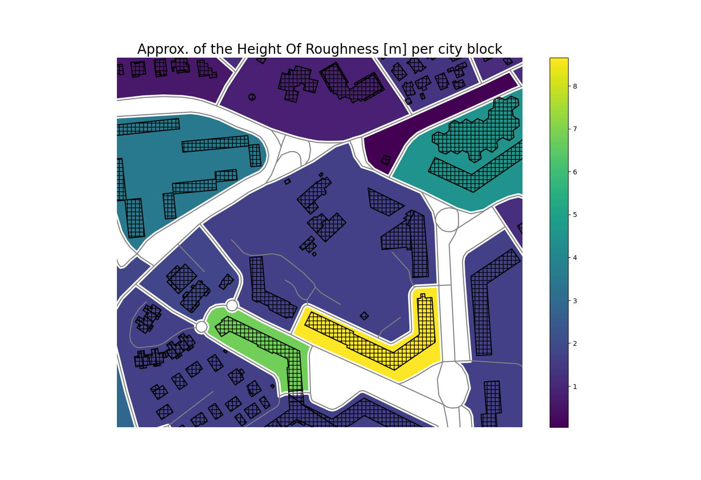

# Urban fabrics analysis

The study of urban fabrics can proceed by analyzing the interrelationships between components identified in a form of successive nesting (the building, the plot, the urban block, the district, etc.). As these topographic components are sometimes missing (or not usable in the sense of the above-mentioned successive nestings), it may be useful to determine and delineate them automatically. As an illustration, ([Hamaina et al., 2013](https://doi.org/10.1007/978-3-642-31833-7_16)) proposes a mechanism to automatically construct a set of plots from building footprints. This first result allows to define a notion of plots neighborhood.

For the purpose of this brief documentation, we will use a technique called [polygonization](https://shapely.readthedocs.io/en/stable/manual.html#shapely.ops.polygonize) to automatically construct a set of city blocks from the street network data. To simplify its use, we have wrapped this mechanism via the class ```t4gpd.morph.STPolygonize```. This is what the following instructions allow:

```python
import matplotlib.pyplot as plt
from geopandas import GeoDataFrame
from pandas import concat
from shapely.geometry import box
from t4gpd.demos.GeoDataFrameDemos3 import GeoDataFrameDemos3
from t4gpd.morph.STPolygonize import STPolygonize

buildings = GeoDataFrameDemos3.irisPasDuLoupInMontpellierBuildings()
roads1 = GeoDataFrameDemos3.irisPasDuLoupInMontpellierRoads()
roi = GeoDataFrame([{'geometry': box(*roads1.total_bounds)}], crs=roads1.crs)

roads2 = GeoDataFrame(concat([roads1[['geometry']], roi[['geometry']]]), crs=roads1.crs)

blocks1 = STPolygonize(roads2).run()
blocks1.geometry = blocks1.geometry.apply(lambda g: g.buffer(-2.0))

minx, miny, maxx, maxy = roi.buffer(-80.0).total_bounds
minx, miny, maxx, maxy = blocks1[blocks1.gid == 6].buffer(80.0).total_bounds

fig, basemap = plt.subplots(figsize=(1.75 * 8.26, 1.2 * 8.26))
basemap.set_title('City blocks', fontsize=20)
blocks1.plot(ax=basemap, column='gid')
buildings.boundary.plot(ax=basemap, color='black', hatch='+++')
roads1.plot(ax=basemap, color='grey')
basemap.axis('off')
basemap.axis([minx, maxx, miny, maxy])
plt.savefig('img/city_blocks.png')
```



## Building Surface Fraction

With these city blocks defined, we can then use the class *t4gpd.morph.geoProcesses.SurfaceFraction* to determine the fraction of built area per block. This is precisely what we do with the following instructions.

```python
import matplotlib.pyplot as plt
from geopandas import GeoDataFrame
from pandas import concat
from shapely.geometry import box
from t4gpd.demos.GeoDataFrameDemos3 import GeoDataFrameDemos3
from t4gpd.morph.geoProcesses.STGeoProcess import STGeoProcess
from t4gpd.morph.geoProcesses.SurfaceFraction import SurfaceFraction
from t4gpd.morph.STPolygonize import STPolygonize

buildings = GeoDataFrameDemos3.irisPasDuLoupInMontpellierBuildings()
roads1 = GeoDataFrameDemos3.irisPasDuLoupInMontpellierRoads()
roi = GeoDataFrame([{'geometry': box(*roads1.total_bounds)}], crs=roads1.crs)

roads2 = GeoDataFrame(concat([roads1[['geometry']], roi[['geometry']]]), crs=roads1.crs)

blocks1 = STPolygonize(roads2).run()
blocks1.geometry = blocks1.geometry.apply(lambda g: g.buffer(-2.0))

op = SurfaceFraction(buildings, buffDist=None)
blocks2 = STGeoProcess(op, blocks1).run()
blocks2 = blocks2.loc[ blocks2[blocks2.surf_ratio > 0].index ]

minx, miny, maxx, maxy = blocks1[blocks1.gid == 6].buffer(80.0).total_bounds

fig, basemap = plt.subplots(figsize=(1.75 * 8.26, 1.2 * 8.26))
basemap.set_title('Approx. of the Building Surface Fraction [%] per city block', fontsize=20)
blocks2.plot(ax=basemap, column='surf_ratio', legend=True)
buildings.boundary.plot(ax=basemap, color='black', hatch='++')
roads1.plot(ax=basemap, color='grey')
basemap.axis('off')
basemap.axis([minx, maxx, miny, maxy])
plt.savefig('img/bsf.png')
```



## Height of Roughness

The Height of Roughness is an indicator that embeds volume information. It can be useful, for example, to determine wind profiles in the framework of aeraulic studies. To determine the Height of Roughness of city blocks, we proceed in an equivalent way by essentially changing the operator from *t4gpd.morph.geoProcesses.SurfaceFraction* to *t4gpd.morph.geoProcesses.HeightOfRoughness*:

```python
import matplotlib.pyplot as plt
from geopandas import GeoDataFrame
from pandas import concat
from shapely.geometry import box
from t4gpd.demos.GeoDataFrameDemos3 import GeoDataFrameDemos3
from t4gpd.morph.geoProcesses.STGeoProcess import STGeoProcess
from t4gpd.morph.geoProcesses.HeightOfRoughness import HeightOfRoughness
from t4gpd.morph.STPolygonize import STPolygonize

buildings = GeoDataFrameDemos3.irisPasDuLoupInMontpellierBuildings()
roads1 = GeoDataFrameDemos3.irisPasDuLoupInMontpellierRoads()
roi = GeoDataFrame([{'geometry': box(*roads1.total_bounds)}], crs=roads1.crs)

roads2 = GeoDataFrame(concat([roads1[['geometry']], roi[['geometry']]]), crs=roads1.crs)

blocks1 = STPolygonize(roads2).run()
blocks1.geometry = blocks1.geometry.apply(lambda g: g.buffer(-2.0))

op = HeightOfRoughness(buildings, elevationFieldName='HAUTEUR', buffDist=None)
blocks2 = STGeoProcess(op, blocks1).run()
blocks2 = blocks2.loc[ blocks2[blocks2.hre > 0].index ]

minx, miny, maxx, maxy = blocks1[blocks1.gid == 6].buffer(80.0).total_bounds

fig, basemap = plt.subplots(figsize=(1.75 * 8.26, 1.2 * 8.26))
basemap.set_title('Approx. of the Height Of Roughness [m] per city block', fontsize=20)
blocks2.plot(ax=basemap, column='hre', legend=True)
buildings.boundary.plot(ax=basemap, color='black', hatch='++')
roads1.plot(ax=basemap, color='grey')
basemap.axis('off')
basemap.axis([minx, maxx, miny, maxy])
plt.savefig('img/hre.png')
```


