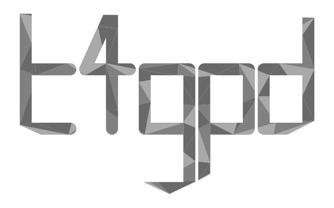

# Welcome to *The t4gpd User Manual*
```
By: Thomas Leduc, AAU-CRENAU
Date: Oct. 2023
Version: 0.8.0
```

**t4gpd** is a set of tools focused on spatial analysis. Developed in
Python (v3), it aims to be used for example in the context of a
Notebook as a complement to the
[GeoPandas](https://geopandas.org/){target=_blank},
[Shapely](https://shapely.readthedocs.io){target=_blank} and
[PyVista](https://docs.pyvista.org/){target=_blank} libraries.

[](https://github.com/crenau/t4gpd){target=_blank}
