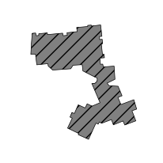
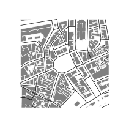
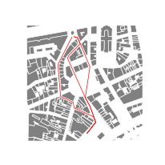

# Introduction

## How to install *t4gpd*

Please visit [this web
page](https://github.com/crenau/t4gpd){target=_blank}.

## What is the installed version number of *t4gpd*? 

```python
import t4gpd

print(t4gpd.__version__)
```

## How to load pre-recorded demos datasets

This section aims to present several static methods of the
*t4gpd.demos.GeoDataFrameDemos* class. More precisely, it is about
presenting the following methods:

> `GeoDataFrameDemos.singleBuildingInNantes()`

> `GeoDataFrameDemos.districtRoyaleInNantesBuildings()`

> `GeoDataFrameDemos.districtRoyaleInNantesRoads()`

> `GeoDataFrameDemos.districtRoyaleInNantesPaths()`

**Note&nbsp;:** As you can see, these methods expect no arguments.

### Loading a single building footprint

In the following code snippet, *buildings* is a classical GeoPandas
[GeoDataFrame](https://geopandas.org/docs/reference/api/geopandas.GeoDataFrame.html?highlight=geodataframe#geopandas.GeoDataFrame){target=_blank}. You
could replace this instruction by loading a shp file from your hard
disk using the
[geopandas.read_file(...)](https://geopandas.org/docs/reference/api/geopandas.read_file.html?highlight=read_file#geopandas.read_file){target=_blank}
method.

```python
from t4gpd.demos.GeoDataFrameDemos import GeoDataFrameDemos

building = GeoDataFrameDemos.singleBuildingInNantes()
```

To map it via matplotlib, proceed as follows:

```python
import matplotlib.pyplot as plt

_, basemap = plt.subplots(figsize=(0.25*8.26, 0.25*8.26))
building.plot(ax=basemap, color='grey', edgecolor='black', hatch='//', linewidth=0.5)
plt.axis('off')
plt.savefig('img/demo1.png')
```



### Loading a set of buildings and roads

To load a pre-recorded dataset of 248 building footprints and more than 3.6 km of roads[^IGNBDTOPO], proceed as follows:

[^IGNBDTOPO]: 
	These building and road geometries are derived from the [IGN's BD Topo](https://geoservices.ign.fr/documentation/diffusion/telechargement-donnees-libres.html#bd-topo){target=_blank}.

```python
from t4gpd.demos.GeoDataFrameDemos import GeoDataFrameDemos

buildings = GeoDataFrameDemos.districtRoyaleInNantesBuildings()
roads = GeoDataFrameDemos.districtRoyaleInNantesRoads()
```

To map it via matplotlib, proceed as follows:

```python
import matplotlib.pyplot as plt

_, basemap = plt.subplots(figsize=(0.25*8.26, 0.25*8.26))
buildings.plot(ax=basemap, color='grey', edgecolor='white', linewidth=0.5)
roads.plot(ax=basemap, color='black', linewidth=0.5)
plt.axis('off')
plt.savefig('img/demo2.png')
```



### Loading a set of pedestrian routes

To load a pre-recorded dataset of 3 pedestrian routes, proceed as follows:

```python
from t4gpd.demos.GeoDataFrameDemos import GeoDataFrameDemos

pathways = GeoDataFrameDemos.districtRoyaleInNantesPaths()
```

To map it via matplotlib, proceed as follows:

```python
import matplotlib.pyplot as plt

_, basemap = plt.subplots(figsize=(0.25*8.26, 0.25*8.26))
buildings.plot(ax=basemap, color='grey', edgecolor='white', linewidth=0.5)
pathways.plot(ax=basemap, color='red', linewidth=0.5)
plt.axis('off')
plt.savefig('img/demo3.png')
```

*Note:* This mapping presupposes that you have already [loaded the
 building footprints](#loading-a-set-of-buildings-and-roads).



## t4gpd embeds two distinct types of geoprocessing

### Geoprocesses derived from *AbstractGeoprocess*

The first category of geoprocesses derives from the
*AbstractGeoprocess* class. The specificity of these geoprocesses is
that they cannot be invoked directly but through the *STGeoProcess*
class.

> `STGeoProcess(geoprocessToApply, gdf)`

This is for example the case of the *BBox* class (*BBox* stands for
bounding box), which must be explicitly invoked as in the following
code snippet:

```python
from t4gpd.demos.GeoDataFrameDemos import GeoDataFrameDemos
from t4gpd.morph.geoProcesses.BBox import BBox
from t4gpd.morph.geoProcesses.STGeoProcess import STGeoProcess

building = GeoDataFrameDemos.singleBuildingInNantes()
bbox = STGeoProcess(BBox(), building).run()
```

The following classes are in the same category (non-exhaustive list):
AngularAbscissa, AreaConvexityDefect, AspectRatio, BBox,
BiggestInscribedDisc, CanyonStreetOrientation,
[CircularityIndices](/morphometry/#circularity-indices),
[ConvexHull](/morphometry/#convex-hull),
[ConvexityIndices](/morphometry/#convexity-indices), Diameter,
[EllipticityIndices](/morphometry/#ellipticity-indices),
[FootprintExtruder](/io/#preamble-how-to-extrude-2d-geometry-to-produce-a-closed-volume),
GridFace, [HeightOfRoughness](/fabrics/#height-of-roughness), HMean,
IdentifyTheClosestPolyline,
[MABE](/morphometry/#minimum-area-bounding-ellipse), MABR2,
[MABR](/morphometry/#minimum-area-bounding-rectangle),
[MBC](/morphometry/#minimum-bounding-circle),
[MPBR](/morphometry/#minimum-area-bounding-rectangle),
[RectangularityIndices](/morphometry/#rectangularity-indices),
RemoveHoles, Rotation2D, [SkyMap2D](/landscape/#sky-map),
SkyViewFactorOnTopOfRoof,
[SkyViewFactor](/bioclimatic/#sky-view-factor),
[StarShapedIndices](/landscape/#indices-for-star-shaped-polygons),
[SurfaceFraction](/fabrics/#building-surface-fraction), Translation,
WMean.

### Geoprocesses derived from *GeoProcess*

This second category gathers the largest number of geoprocessing
operations. As direct subclasses of the *GeoProcess* class, these
geoprocesses offer two distinct methods: *run()* and *execute()*. The
second one returns, in addition to the result of the first one, a
measure of the calculation time.
