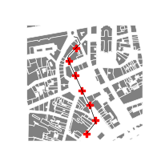

# Introduction

## How to install *t4gpd*
Please visit [this web page](https://github.com/crenau/t4gpd).

## What is the installed version number of *t4gpd*? 

```python
import t4gpd

print(t4gpd.__version__)
```

## How to load pre-recorded demos datasets

This section aims to present several static methods of the `t4gpd.demos.GeoDataFrameDemos` class. More precisely, it is about presenting the following methods:

- singleBuildingInNantes()
- districtRoyaleInNantesBuildings()
- districtRoyaleInNantesRoads()
- districtRoyaleInNantesPaths()

**Note&nbsp;:** As you can see, these methods expect no arguments.

### Loading a single building footprint
In the following code snippet, `buildings` is a classical GeoPandas [GeoDataFrame](https://geopandas.org/docs/reference/api/geopandas.GeoDataFrame.html?highlight=geodataframe#geopandas.GeoDataFrame). You could replace this instruction by loading a shp file from your hard disk using the [geopandas.read_file(...)](https://geopandas.org/docs/reference/api/geopandas.read_file.html?highlight=read_file#geopandas.read_file) method.

```python
from t4gpd.demos.GeoDataFrameDemos import GeoDataFrameDemos

building = GeoDataFrameDemos.singleBuildingInNantes()
```

To map it via matplotlib, proceed as follows:

```python
import matplotlib.pyplot as plt

_, basemap = plt.subplots(figsize=(0.25*8.26, 0.25*8.26))
building.plot(ax=basemap, color='grey', edgecolor='black', hatch='//', linewidth=0.5)
plt.axis('off')
plt.savefig('img/demo1.png')
```


### Loading a set of buildings and roads

To load a pre-recorded dataset of 248 building footprints and more than 3.6 km of roads[^IGNBDTOPO], proceed as follows:

[^IGNBDTOPO]: 
	These building and road geometries are derived from the [IGN's BD Topo](https://geoservices.ign.fr/documentation/diffusion/telechargement-donnees-libres.html#bd-topo).

```python
from t4gpd.demos.GeoDataFrameDemos import GeoDataFrameDemos

buildings = GeoDataFrameDemos.districtRoyaleInNantesBuildings()
roads = GeoDataFrameDemos.districtRoyaleInNantesRoads()
```

To map it via matplotlib, proceed as follows:

```python
import matplotlib.pyplot as plt

_, basemap = plt.subplots(figsize=(0.25*8.26, 0.25*8.26))
buildings.plot(ax=basemap, color='grey', edgecolor='white', linewidth=0.5)
roads.plot(ax=basemap, color='black', linewidth=0.5)
plt.axis('off')
plt.savefig('img/demo2.png')
```


### Loading a set of pedestrian routes

To load a pre-recorded dataset of 3 pedestrian routes, proceed as follows:

```python
from t4gpd.demos.GeoDataFrameDemos import GeoDataFrameDemos

pathways = GeoDataFrameDemos.districtRoyaleInNantesPaths()
```

To map it via matplotlib, proceed as follows:

```python
import matplotlib.pyplot as plt

_, basemap = plt.subplots(figsize=(0.25*8.26, 0.25*8.26))
buildings.plot(ax=basemap, color='grey', edgecolor='white', linewidth=0.5)
pathways.plot(ax=basemap, color='red', linewidth=0.5)
plt.axis('off')
plt.savefig('img/demo3.png')
```

*Note:* This mapping presupposes that you have already [loaded the building footprints](#loading-a-set-of-buildings-and-roads).


## Deployment of virtual sensors
### Along urban routes

```python
from t4gpd.demos.GeoDataFrameDemos import GeoDataFrameDemos
from t4gpd.morph.STDensifier import STDensifier

pathways = GeoDataFrameDemos.districtRoyaleInNantesPaths()
pathways = pathways[ pathways.gid == 2 ]

sensors = STDensifier(pathways, distance=45.0, 
	adjustableDist=True, removeDuplicate=False).run()
```

To map it via matplotlib, proceed as follows:

```python
import matplotlib.pyplot as plt

_, basemap = plt.subplots(figsize=(0.25*8.26, 0.25*8.26))
buildings.plot(ax=basemap, color='grey', edgecolor='white', linewidth=0.5)
pathways.plot(ax=basemap, color='black', linewidth=0.5)
sensors.plot(ax=basemap, color='red', marker='P')
plt.axis('off')
plt.savefig('img/demo4.png')
```

*Note:* This mapping presupposes that you have already [loaded the building footprints](#loading-a-set-of-buildings-and-roads).



### On the vertices of a grid

```python
from t4gpd.demos.GeoDataFrameDemos import GeoDataFrameDemos
from t4gpd.morph.STGrid import STGrid

buildings = GeoDataFrameDemos.districtRoyaleInNantesBuildings()

sensors = STGrid(buildings, dx=20, dy=None, indoor=False, intoPoint=True).run()
```

To map it via matplotlib, proceed as follows:

```python
import matplotlib.pyplot as plt
from shapely.geometry import box

minx, miny, maxx, maxy = box(*buildings.total_bounds).buffer(-50).bounds

_, basemap = plt.subplots(figsize=(0.25*8.26, 0.25*8.26))
buildings.plot(ax=basemap, color='grey', edgecolor='white', linewidth=0.5)
sensors.plot(ax=basemap, color='red', marker='+')

basemap.axis([minx, maxx, miny, maxy])
plt.axis('off')
plt.savefig('img/demo5.png')
```


### Along the skeleton of the urban open space

```python
from t4gpd.demos.GeoDataFrameDemos import GeoDataFrameDemos
from t4gpd.morph.STDensifier import STDensifier
from t4gpd.morph.STSkeletonizeTheVoid import STSkeletonizeTheVoid

buildings = GeoDataFrameDemos.districtRoyaleInNantesBuildings()

skeleton = STSkeletonizeTheVoid(buildings, samplingDist=5.0).run()

sensors = STDensifier(skeleton, distance=15.0, 
	adjustableDist=True, removeDuplicate=False).run()
```

To map it via matplotlib, proceed as follows:

```python
import matplotlib.pyplot as plt
from shapely.geometry import box

minx, miny, maxx, maxy = box(*buildings.total_bounds).buffer(-70).bounds

_, basemap = plt.subplots(figsize=(0.25*8.26, 0.25*8.26))
buildings.plot(ax=basemap, color='grey', edgecolor='white', linewidth=0.5)
skeleton.plot(ax=basemap, color='black', linewidth=0.5)
sensors.plot(ax=basemap, color='red', marker='.')

basemap.axis([minx, maxx, miny, maxy])
plt.axis('off')
plt.savefig('img/demo6.png')
```


## Meshing of the urban space

### Grid the region of interest
If you want to grid the region of interest proceed as follows:

```python
from t4gpd.demos.GeoDataFrameDemos import GeoDataFrameDemos
from t4gpd.morph.STGrid import STGrid

buildings = GeoDataFrameDemos.districtRoyaleInNantesBuildings()

grid = STGrid(buildings, dx=20, dy=None, indoor='both', intoPoint=False).run()
```

To map the resulting grid via matplotlib, proceed as follows:

```python
import matplotlib.pyplot as plt
from shapely.geometry import box

minx, miny, maxx, maxy = box(*buildings.total_bounds).buffer(-50).bounds

_, basemap = plt.subplots(figsize=(0.25*8.26, 0.25*8.26))
buildings.plot(ax=basemap, color='grey', edgecolor='white', linewidth=0.5)
grid.boundary.plot(ax=basemap, color='red', linewidth=0.5)

basemap.axis([minx, maxx, miny, maxy])
plt.axis('off')
plt.savefig('img/demo7.png')
```


### How to build a Triangulated irregular network (TIN)

The mesh we will produce here assumes that you have installed the [GMSH three-dimensional finite element mesh generator](https://gmsh.info/). As you can see from the following code snippet, the *gmsh* argument of the *GmshTriangulator* command is used to specify the location of the GMSH executable.

```python
from t4gpd.demos.GeoDataFrameDemos import GeoDataFrameDemos
from t4gpd.morph.GmshTriangulator import GmshTriangulator

building = GeoDataFrameDemos.singleBuildingInNantes()
tin = GmshTriangulator(building, characteristicLength=15.0,
	gmsh='/usr/local/bin/gmsh').run()
```


To map the resulting mesh via matplotlib, proceed as follows:

```python
import matplotlib.pyplot as plt

_, basemap = plt.subplots(figsize=(0.25*8.26, 0.25*8.26))
building.plot(ax=basemap, color='grey', edgecolor='white', linewidth=0.5)
tin.boundary.plot(ax=basemap, color='red', linewidth=0.25)

plt.axis('off')
plt.savefig('img/demo8.png')
```


