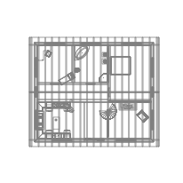
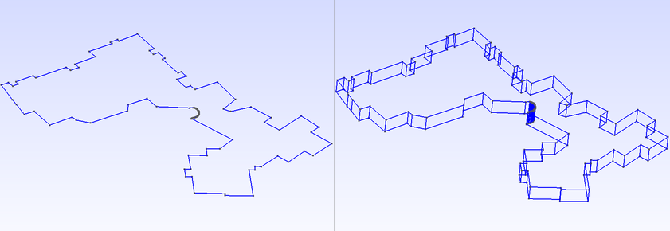
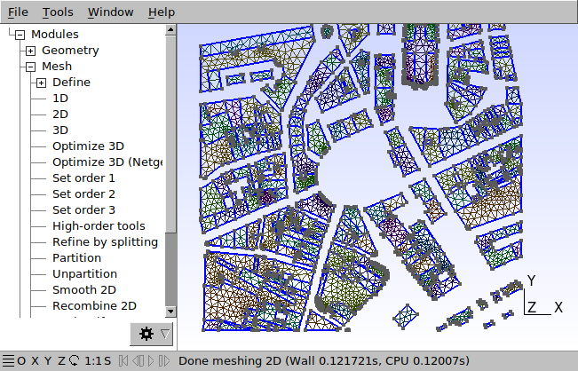
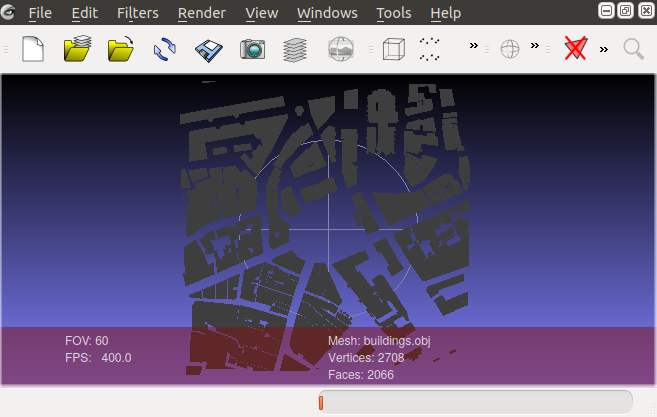
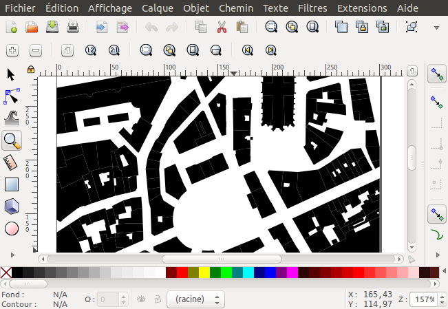
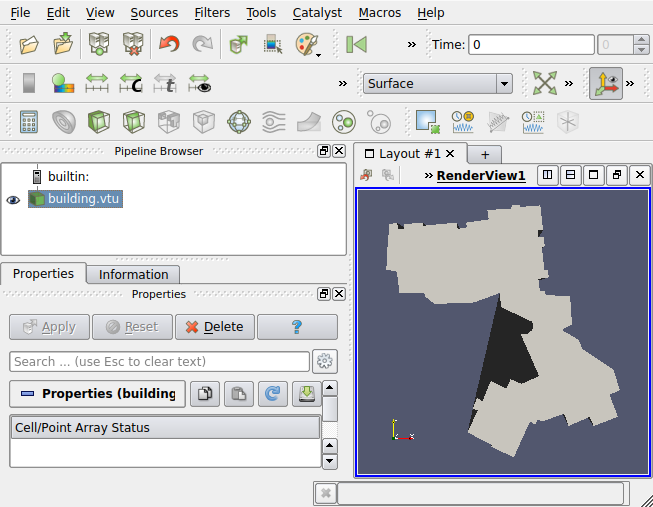
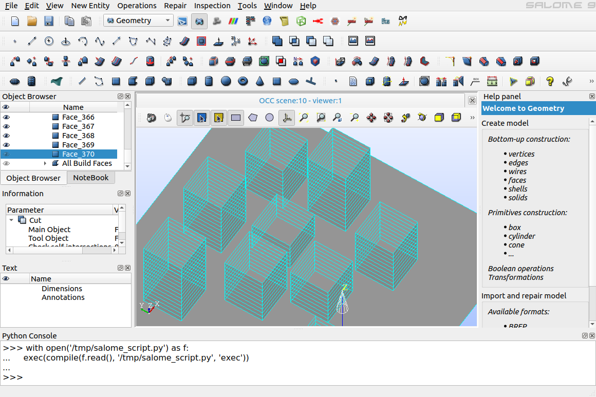
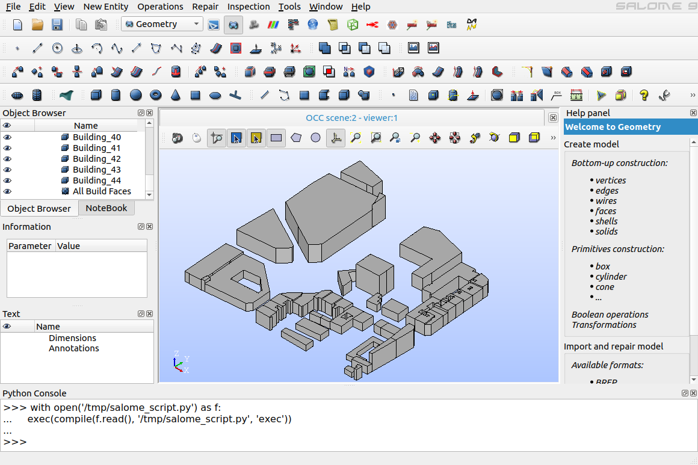

# Reading and writing files

## Reading files
### Reading CIR (Solene) files

[Solene](https://aau.archi.fr/crenau/solene/){target=_blank} is an
(old) software tool developed in the 1990s and early 2000s at the
AAU-CERMA laboratory (the forerunner of the current [AAU-CRENAU
laboratory](https://aau.archi.fr/){target=_blank}). Originally
dedicated to the urban and architectural projects' solar and light
access and thermal radiation calculations, it was then extended to the
study of different dimensions of the urban microclimate. This project
is now archived. Its sources are distributed under the GNU General
Public License at
[SourceSup](https://sourcesup.renater.fr/projects/solenetb/){target=_blank}.

To load a geometry file stored in the Solene file format (.cir
extension), proceed as follows:

```python
from t4gpd.io.CirReader import CirReader

myGdf = CirReader('../data/cube_unitaire.cir').run()
```

The resulting object named *myGdf* is an instance of GeoDataFrame.

### Partial support of CityGML files

The
[FZK-Haus](https://www.citygmlwiki.org/index.php?title=FZK_Haus){target=_blank}
is a data set provided by the Karlsruhe Institute of Technology (KIT),
Institute for Applied Computer Science (Campus North). Let's load it
using *t4gpd.io.CityGMLReader*:

```python
from t4gpd.io.CityGMLReader import CityGMLReader

myGdf = CityGMLReader('./AC11-FZK-Haus_LoD4_SpaceSolid_v1.0.0.gml',
	srcEpsgCode='EPSG:3068').run()
```

The resulting object named *myGdf* is an instance of GeoDataFrame. To
map it via matplotlib, proceed as follows:

```python
import matplotlib.pyplot as plt

_, basemap = plt.subplots(figsize=(0.25*8.26, 0.25*8.26))
myGdf.boundary.plot(ax=basemap, color='grey', linewidth=0.15)
plt.axis('off')
plt.savefig('img/citygml.png')
```



### Reading OBJ files

To load a geometry file stored in the OBJ file format, proceed as follows:

```python
from t4gpd.io.ObjReader import ObjReader

myGdf = ObjReader('/tmp/buildings.obj').run()
```

The resulting object named *myGdf* is an instance of GeoDataFrame.

### Reading MSH (GMSH) files

To load a geometry file stored in the GMSH/MSH file format (.msh
extension), proceed as follows:

```python
from t4gpd.demos.GeoDataFrameDemos import GeoDataFrameDemos
from t4gpd.io.MshReader import MshReader

buildings = GeoDataFrameDemos.districtRoyaleInNantesBuildings()

myGdf = MshReader('/tmp/buildings.msh', bbox=buildings.total_bounds, crs='EPSG:2154').run()
```

The resulting object named *myGdf* is an instance of GeoDataFrame.

### Reading MED files

To load a geometry file stored in the .MED file format (.med
extension), proceed as follows:

```python
from t4gpd.io.MedReader import MedReader

myGdf = MedReader('/tmp/buildings.med', crs='EPSG:2154').run()
```

The resulting object named *myGdf* is an instance of GeoDataFrame.


## Writing files

### Preamble: How to extrude 2D geometry to produce a closed volume

```python
from t4gpd.demos.GeoDataFrameDemos import GeoDataFrameDemos
from t4gpd.morph.geoProcesses.FootprintExtruder import FootprintExtruder
from t4gpd.morph.geoProcesses.STGeoProcess import STGeoProcess

building = GeoDataFrameDemos.singleBuildingInNantes()

op = FootprintExtruder(building, elevationFieldname='HAUTEUR', forceZCoordToZero=True)
buildingVolume = STGeoProcess(op, building).run()
```



### Writing CIR (Solene) files

[Solene](https://aau.archi.fr/crenau/solene/){target=_blank} is an
(old) software tool developed in the 1990s and early 2000s at the
AAU-CERMA laboratory (the forerunner of the current [AAU-CRENAU
laboratory](https://aau.archi.fr/){target=_blank}). Originally
dedicated to the urban and architectural projects' solar and light
access and thermal radiation calculations, it was then extended to the
study of different dimensions of the urban microclimate. This project
is now archived. Its sources are distributed under the GNU General
Public License at
[SourceSup](https://sourcesup.renater.fr/projects/solenetb/){target=_blank}.

To save a GeoDataFrame in the Solene file format (.cir extension),
proceed as follows:

```python
from t4gpd.demos.GeoDataFrameDemos import GeoDataFrameDemos
from t4gpd.io.CirWriter import CirWriter

buildings = GeoDataFrameDemos.districtRoyaleInNantesBuildings()

CirWriter(buildings, '/tmp/buildings.cir').run()
```

### Writing GEO (GMSH) files

```python
from t4gpd.demos.GeoDataFrameDemos import GeoDataFrameDemos
from t4gpd.io.GeoWriter import GeoWriter

buildings = GeoDataFrameDemos.districtRoyaleInNantesBuildings()

GeoWriter(buildings, '/tmp/buildings.geo', characteristicLength=10.0, toLocalCrs=True).run()
```

It is then possible, as shown in the figure below, to open the file
*/tmp/buildings.geo* in the [GMSH](http://gmsh.info/){target=_blank}
three-dimensional finite element mesh generator, then to mesh it.



### Writing OBJ files

```python
from t4gpd.demos.GeoDataFrameDemos import GeoDataFrameDemos
from t4gpd.io.ObjWriter import ObjWriter

buildings = GeoDataFrameDemos.districtRoyaleInNantesBuildings()
buildings = buildings.explode()

ObjWriter(buildings, '/tmp/buildings.obj').run()
```

It is then possible, as an example, to open the file
*/tmp/buildings.obj* in
[Meshlab](https://www.meshlab.net/){target=_blank} or
[ParaView](https://www.paraview.org/){target=_blank}.



### Writing SVG files

```python
from t4gpd.demos.GeoDataFrameDemos import GeoDataFrameDemos
from t4gpd.io.SVGWriter import SVGWriter

buildings = GeoDataFrameDemos.districtRoyaleInNantesBuildings()

SVGWriter(buildings, '/tmp/buildings.svg', bbox=None, color='black').run()
```

It is then possible, as an example, to open the file
*/tmp/buildings.svg* in
[Inkscape](https://inkscape.org/){target=_blank}.



### Writing VTU files

```python
from t4gpd.demos.GeoDataFrameDemos import GeoDataFrameDemos
from t4gpd.io.VTUWriter import VTUWriter

building = GeoDataFrameDemos.singleBuildingInNantes()

VTUWriter(building, '/tmp/building.vtu').run()
```

It is then possible, as an example, to open the file
*/tmp/building.vtu* in
[ParaView](https://www.paraview.org/){target=_blank}.



### Writing ZIP files

The *t4gpd.io.ZipWriter* class allows to encapsulate several DataFrame
or GeoDataFrame in a single .zip file on disk. The following
instructions will create an archive on disk with the name
*/tmp/myZipFile.zip*:

```python
from t4gpd.demos.GeoDataFrameDemos import GeoDataFrameDemos
from t4gpd.io.ZipWriter import ZipWriter

buildings = GeoDataFrameDemos.districtRoyaleInNantesBuildings()
roads = GeoDataFrameDemos.districtRoyaleInNantesRoads()
mapOfDf = {'buildings': buildings, 'roads': roads}
ZipWriter(mapOfDf, '/tmp/myZipFile', driver='ESRI Shapefile').run()
```

Various values for the driver option are possible: 'ESRI Shapefile',
'GPKG' and 'GeoJSON'.

The contents of this archive */tmp/myZipFile.zip* are as follows:

```
Archive:  /tmp/myZipFile.zip
  Length      Date    Time    Name
---------  ---------- -----   ----
      452  2021-10-08 10:51   myZipFile/roads.prj
    14860  2021-10-08 10:51   myZipFile/roads.shp
     2084  2021-10-08 10:51   myZipFile/buildings.shx
    89868  2021-10-08 10:51   myZipFile/buildings.shp
      452  2021-10-08 10:51   myZipFile/buildings.prj
    26138  2021-10-08 10:51   myZipFile/buildings.dbf
        5  2021-10-08 10:51   myZipFile/buildings.cpg
      964  2021-10-08 10:51   myZipFile/roads.shx
    11438  2021-10-08 10:51   myZipFile/roads.dbf
        5  2021-10-08 10:51   myZipFile/roads.cpg
---------                     -------
   146266                     10 files
```

### Writing GPKG files

The *t4gpd.io.GpkgWriter* class allows to encapsulate several DataFrame
or GeoDataFrame in a single .gpkg file on disk. The following
instructions will create an archive on disk with the name
*/tmp/myGpkgFile.gpkg*:

```python
from t4gpd.demos.GeoDataFrameDemos import GeoDataFrameDemos
from t4gpd.io.GpkgWriter import GpkgWriter

buildings = GeoDataFrameDemos.districtRoyaleInNantesBuildings()
roads = GeoDataFrameDemos.districtRoyaleInNantesRoads()
mapOfDf = {'buildings': buildings, 'roads': roads}
GpkgWriter(mapOfDf, '/tmp/myGpkgFile.gpkg').run()
```

The contents of this archive */tmp/myGpkgFile.gpkg* can be listed using the following instructions:

```python
from fiona import listlayers
listlayers("/tmp/myGpkgFile.gpkg")
```

The contents of this archive */tmp/myGpkgFile.gpkg* can be re-read using the following instructions:

```python
from geopandas import read_file
roads = read_file("/tmp/myGpkgFile.gpkg", layer="roads")
```

### Writing Python for Salome files (version 0.4.0+)

[SALOME](https://salome-platform.org/){target=_blank} is an open source platform for numerical simulation (multi-physics). It is a parametric shape modeler, which offers meshing, coupled simulation and visualization capabilities. To export your geometries in a python script that can be read by SALOME, proceed as follows:

```python
from t4gpd.demos.GeoDataFrameDemos5 import GeoDataFrameDemos5
from t4gpd.io.SalomeWriter import SalomeWriter

gdf = GeoDataFrameDemos5.cirSceneMasque1Corr()
SalomeWriter(gdf, '/tmp/salome_script.py', withFaceIds=True, exportBrep=False).run()
```

You must then, in the Python console of SALOME, copy and paste the following instructions:

```python
with open('/tmp/salome_script.py') as f:
    exec(compile(f.read(), '/tmp/salome_script.py', 'exec'))
```

To view the scene, you may have to refresh the *Object Browser*.



### Writing Python for Salome files (2) (version 0.4.0+)

t4gpd offers a second method of interfacing to SALOME that combines the geometry export process with an extrusion process of building footprints directly into SALOME. To implement it, proceed as follows (be careful to prepare your input dataset):

```python
from t4gpd.commons.GeomLib import GeomLib
from t4gpd.demos.GeoDataFrameDemos import GeoDataFrameDemos
from t4gpd.io.SalomeWriterAndExtruder import SalomeWriterAndExtruder

gdf = GeoDataFrameDemos.ensaNantesBuildings()
gdf.geometry = gdf.geometry.apply(lambda g: GeomLib.forceZCoordinateToZ0(g, z0=0))
gdf.HAUTEUR.fillna(0, inplace=True)
SalomeWriterAndExtruder(gdf, '/tmp/salome_script.py', elevationFieldname='HAUTEUR',
	withFaceIds=False, exportBrep=True).run()
```

As before, you must then, in the Python console of SALOME, copy and paste the following instructions:

```python
with open('/tmp/salome_script.py') as f:
    exec(compile(f.read(), '/tmp/salome_script.py', 'exec'))
```

To view the scene, you may need to refresh the *object browser*.


