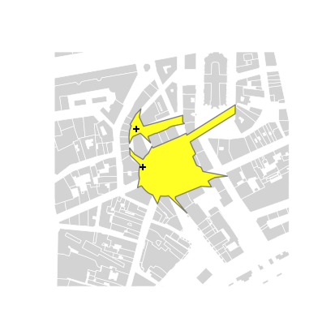
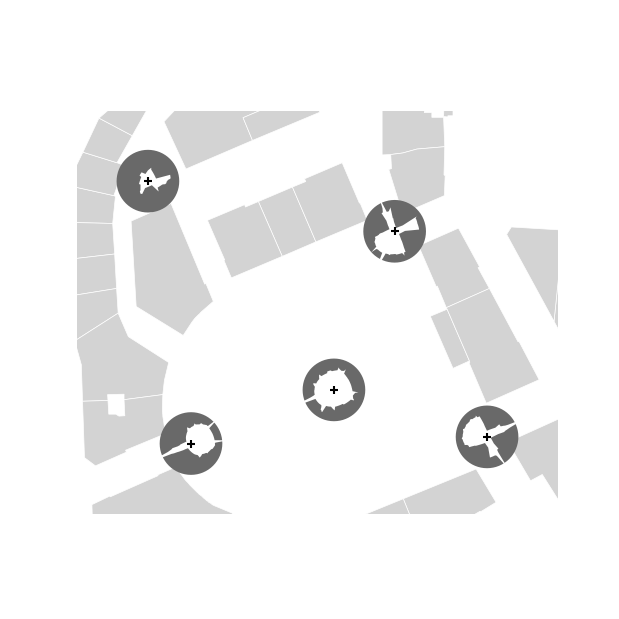
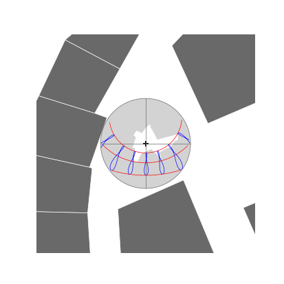

# Urban landscape analysis
## Isovist and isovist field

In 2D, the set of points on the map plane that are directly visible
from the point of view (also called the generation point) is called
isovist. In the case where no opaque surface stops the field of view,
it is sometimes necessary to impose an artificial horizon to limit the
range.

To analyze space in a more systematic way over a territory, [Benedikt
(1979)](https://doi.org/10.1068/b060047) proposes the notion of
isovist field. This is an extrapolation of the mathematical notion of
scalar field (resp. vector field) which associates a scalar (resp. a
vector) with any point in Euclidean space. If the isovist describes
the space surrounding a given point, the isovist field associates, to
any point of the study area, an isovist. The isovist field thus gives
access to the description property of the enveloping space at any
point of interest.

> `STIsovistField2D(buildings, viewpoints, nRays=64, rayLength=100.0)`

```python
from geopandas import GeoDataFrame
from shapely.geometry import Point
from t4gpd.demos.GeoDataFrameDemos import GeoDataFrameDemos
from t4gpd.isovist.STIsovistField2D import STIsovistField2D

buildings = GeoDataFrameDemos.districtRoyaleInNantesBuildings()

pts = [ Point((355143.0, 6689359.4)), Point((355151.5, 6689310.1)) ]
viewpoints = GeoDataFrame([{'gid': i, 'geometry': p} for i,p in enumerate(pts)],
	crs=buildings.crs)

isovRays, isovists = STIsovistField2D(buildings, viewpoints, nRays=180, rayLength=200.0).run()
```

To map it via matplotlib, proceed as follows:

```python
import matplotlib.pyplot as plt
from shapely.geometry import box

_, basemap = plt.subplots(figsize=(0.5*8.26, 0.5*8.26))
buildings.plot(ax=basemap, color='lightgrey', edgecolor='white', linewidth=0.5)
isovists.plot(ax=basemap, edgecolor='dimgrey', color='yellow', alpha=0.85)
viewpoints.plot(ax=basemap, color='black', marker='+')
plt.axis('off')
plt.savefig('img/isovists.png')
```



### Indices for star-shaped polygons

An isovist is, by nature, star-shaped. As noted by [Piombini et
al. (2014)](https://doi.org/10.3166/rig.24.101-130), because of this topological property, such
a shape can be described by simply transcribing its contour into a
radial distance function. This radial distance function associates to
a given azimuth (from the angular abscissa discretization) the length
of the radius connecting the viewpoint to the corresponding contour
point. Most of the shape indices presented below analyze this radial
distance function as a simple distribution of a real variable.

Some of these shape indices are implemented in the class
*t4gpd.morph.geoProcesses.StarShapedIndices*. Using this class helps
quantify - for each tuple of the already defined GeoDataFrame
*isovRays* - the eccentricity (drift), the minimum length
(resp. average, maximum or standard deviation) of the rays, or the
entropy of the radial distance function.

```python
from t4gpd.morph.geoProcesses.STGeoProcess import STGeoProcess
from t4gpd.morph.geoProcesses.StarShapedIndices import StarShapedIndices

result = STGeoProcess(StarShapedIndices(precision=1.0, base=2), isovRays).run()

print(result[['gid', 'drift', 'min_raylen', 'avg_raylen', 
              'std_raylen', 'max_raylen', 'entropy']])
```

## Sky Map

> `SkyMap2D(gdf, nRays=180, size=4.0, maxRayLen=100.0, elevationFieldname='HAUTEUR',`
> `projectionName='Stereographic')`

```python
from geopandas import GeoDataFrame
from shapely.geometry import Point
from t4gpd.demos.GeoDataFrameDemos import GeoDataFrameDemos
from t4gpd.morph.geoProcesses.SkyMap2D import SkyMap2D
from t4gpd.morph.geoProcesses.STGeoProcess import STGeoProcess

buildings = GeoDataFrameDemos.districtRoyaleInNantesBuildings()

pts = [ Point((355154.0, 6689292.4)), Point((355206.0, 6689346.6)),
	Point((355229.6, 6689294.1)), Point((355190.5, 6689306.1)),
	Point((355143.0, 6689359.4)) ]
viewpoints = GeoDataFrame([{'geometry': p} for p in pts], crs=buildings.crs)

op = SkyMap2D(buildings, nRays=180, size=8.0, maxRayLen=100.0, 
	elevationFieldname='HAUTEUR', projectionName='Stereographic')
skymaps = STGeoProcess(op, viewpoints).run()
```

To map it via matplotlib, proceed as follows:

```python
import matplotlib.pyplot as plt
from shapely.geometry import box

minx, miny, maxx, maxy = box(*skymaps.total_bounds).buffer(10).bounds

_, basemap = plt.subplots(figsize=(0.75*8.26, 0.75*8.26))
buildings.plot(ax=basemap, color='lightgrey', edgecolor='white', linewidth=0.5)
skymaps.plot(ax=basemap, color='dimgrey')
viewpoints.plot(ax=basemap, color='black', marker='+')
plt.axis('off')
plt.axis([minx, maxx, miny, maxy])
plt.savefig('img/skymaps.png')
```



## Sky and Sun Maps

> `SkyMap2D(gdf, nRays=180, size=4.0, maxRayLen=100.0, elevationFieldname='HAUTEUR',`
> `projectionName='Stereographic')`

> `STSunMap2D(viewpointsGdf, datetimes, size=4.0, projectionName='Stereographic', tz=None,`
> `model='pysolar')`

```python
from datetime import date, time
from geopandas import GeoDataFrame
from shapely.geometry import Point
from t4gpd.demos.GeoDataFrameDemos import GeoDataFrameDemos
from t4gpd.morph.geoProcesses.SkyMap2D import SkyMap2D
from t4gpd.morph.geoProcesses.STGeoProcess import STGeoProcess
from t4gpd.sun.STSunMap2D import STSunMap2D

buildings = GeoDataFrameDemos.districtRoyaleInNantesBuildings()
viewpoint = GeoDataFrame([{'geometry': Point((355143.0, 6689359.4))}],
	crs=buildings.crs)

op = SkyMap2D(buildings, nRays=180, size=7.0, maxRayLen=100.0, 
	elevationFieldname='HAUTEUR', projectionName='Stereographic')
skymap = STGeoProcess(op, viewpoint).run()

datetimes = [ date(2020, month, 21) for month in (3, 6, 12)]
datetimes += [ time(hour) for hour in range(6, 19, 2) ]

sunmap = STSunMap2D(viewpoint, datetimes, size=7.0,
	projectionName='Stereographic').run()
```

To map it via matplotlib, proceed as follows:

```python
import matplotlib.pyplot as plt
from shapely.geometry import box

minx, miny, maxx, maxy = box(*skymap.total_bounds).buffer(10).bounds

_, basemap = plt.subplots(figsize=(0.5*8.26, 0.5*8.26))
buildings.plot(ax=basemap, color='dimgrey', edgecolor='white', linewidth=0.5)

skymap.plot(ax=basemap, color='lightgrey')
viewpoint.plot(ax=basemap, color='black', marker='+')
sunmap[ sunmap.label == 'framework' ].plot(ax=basemap, linewidth=0.5, color='dimgrey')
sunmap[ sunmap.label.str.startswith('2020-') ].plot(ax=basemap, linewidth=0.5, color='red')
sunmap[ sunmap.label.str.endswith(':00:00') ].plot(ax=basemap, linewidth=0.5, color='blue')
plt.axis('off')
plt.axis([minx, maxx, miny, maxy])
plt.savefig('img/skySunMaps.png')
```


