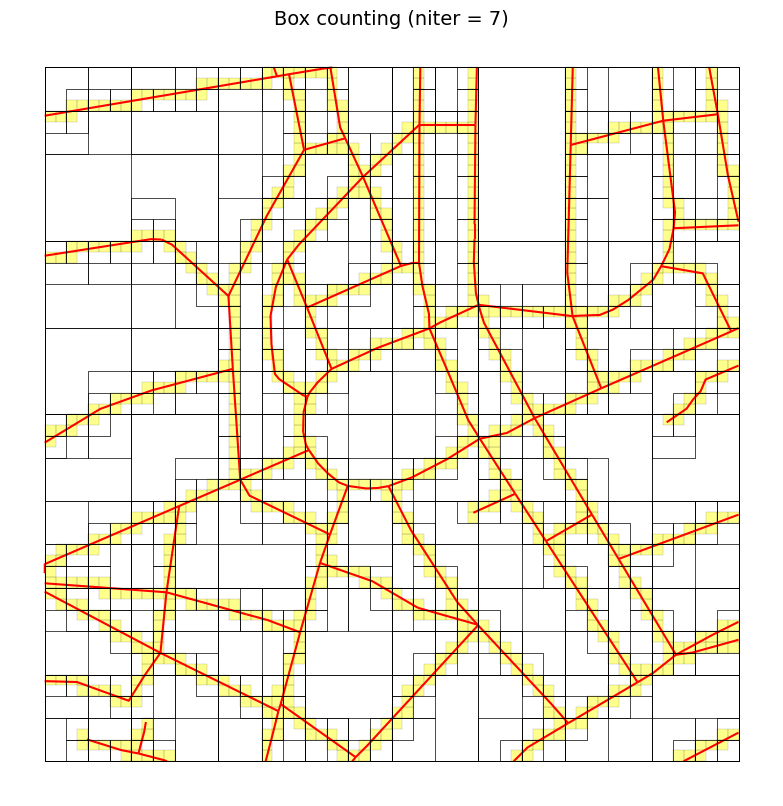
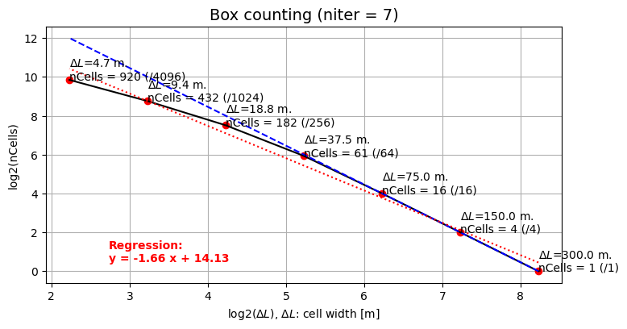

# Analysis of the shape of urban layouts

**t4gpd** is coupled to [NetworkX](https://networkx.org/) and benefits in particular from [betweenness_centrality](https://networkx.org/documentation/latest/reference/algorithms/generated/networkx.algorithms.centrality.betweenness_centrality.html\#networkx.algorithms.centrality.betweenness_centrality) and [closeness_centrality](https://networkx.org/documentation/latest/reference/algorithms/generated/networkx.algorithms.centrality.closeness_centrality.html\#networkx.algorithms.centrality.closeness_centrality) calculations.

## Betweenness centrality

```python
from t4gpd.demos.GeoDataFrameDemos import GeoDataFrameDemos
from t4gpd.graph.STBetweennessCentrality import STBetweennessCentrality

roads = GeoDataFrameDemos.districtRoyaleInNantesRoads()

betweenness = STBetweennessCentrality(roads).run()
```

## Closeness centrality

```python
from t4gpd.demos.GeoDataFrameDemos import GeoDataFrameDemos
from t4gpd.graph.STClosenessCentrality import STClosenessCentrality

roads = GeoDataFrameDemos.districtRoyaleInNantesRoads()

closeness= STClosenessCentrality(roads).run()
```

## Shortest distance on a graph

```python
from geopandas import GeoDataFrame
from shapely.geometry import Point
from t4gpd.demos.GeoDataFrameDemos import GeoDataFrameDemos
from t4gpd.graph.STShortestPath import STShortestPath

roads = GeoDataFrameDemos.districtRoyaleInNantesRoads()

fromPoints = GeoDataFrame([ {'geometry': Point((355126, 6689365))} ], crs=roads.crs)
toPoints = GeoDataFrame([ {'geometry': Point((3553125, 6689362))} ], crs=roads.crs)

result = STShortestPath(roads, fromPoints, toPoints).run()
```

## Box counting algorithm

```python
from t4gpd.demos.GeoDataFrameDemos import GeoDataFrameDemos
from t4gpd.morph.STBoxCounting import STBoxCounting

roads = GeoDataFrameDemos.districtRoyaleInNantesRoads()
boxCountingDict = STBoxCounting(roads, niter=7).run()

STBoxCounting.plotGrids(roads, boxCountingDict, title=None,
	outputFile='img/boxCounting-1.png')
```



```python
STBoxCounting.plotLinearModel(boxCountingDict, title=None,
	outputFile='img/boxCounting-2.png')
```


