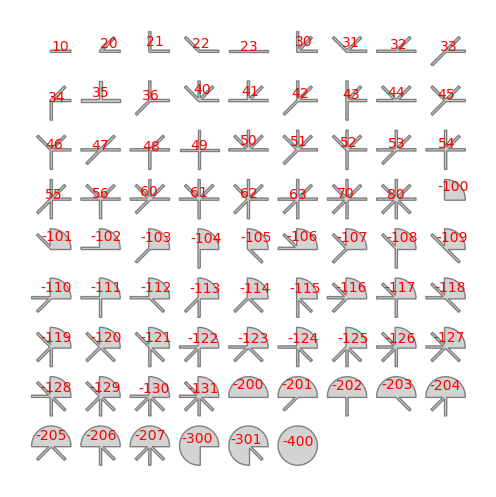

# Analysis of the shape of urban layouts

As ([Hamaina et al., 2011](https://hal.archives-ouvertes.fr/hal-01347325)) shows, the structural analysis of street networks is very useful to characterize the urban factory. This is the reason why we have chosen to couple **t4gpd** to [NetworkX](https://networkx.org/){target=_blank}. This coupling allows to benefit, in the context of **t4gpd**, from 
[betweenness_centrality](https://networkx.org/documentation/latest/reference/algorithms/generated/networkx.algorithms.centrality.betweenness_centrality.html\#networkx.algorithms.centrality.betweenness_centrality){target=_blank}
and
[closeness_centrality](https://networkx.org/documentation/latest/reference/algorithms/generated/networkx.algorithms.centrality.closeness_centrality.html\#networkx.algorithms.centrality.closeness_centrality){target=_blank}
calculations.

## Betweenness centrality

```python
from t4gpd.demos.GeoDataFrameDemos import GeoDataFrameDemos
from t4gpd.graph.STBetweennessCentrality import STBetweennessCentrality

roads = GeoDataFrameDemos.districtRoyaleInNantesRoads()

betweenness = STBetweennessCentrality(roads).run()
```

## Closeness centrality

```python
from t4gpd.demos.GeoDataFrameDemos import GeoDataFrameDemos
from t4gpd.graph.STClosenessCentrality import STClosenessCentrality

roads = GeoDataFrameDemos.districtRoyaleInNantesRoads()

closeness= STClosenessCentrality(roads).run()
```

## Shortest distance on a graph

```python
from geopandas import GeoDataFrame
from shapely.geometry import Point
from t4gpd.demos.GeoDataFrameDemos import GeoDataFrameDemos
from t4gpd.graph.STShortestPath import STShortestPath

roads = GeoDataFrameDemos.districtRoyaleInNantesRoads()

fromPoints = GeoDataFrame([ {'geometry': Point((355126, 6689365))} ], crs=roads.crs)
toPoints = GeoDataFrame([ {'geometry': Point((3553125, 6689362))} ], crs=roads.crs)

result = STShortestPath(roads, fromPoints, toPoints).run()
```

## Street intersection pattern determination (version 0.5.0+)

The structure of the city can be analyzed at various levels of scale. As developed in the article ([Leduc, 2022](https://doi.org/10.1177/23998083221138833){target=_blank}), we propose here "to work on the scale of the street, the one in which the pedestrian is immersed, and more precisely on the scale of its articulations, the street intersections". More specifically, it is a question of "matching between the shape of the open space as captured by the pedestrian in immersion (this visual pattern is more commonly called the isovist) and a corpus of geospatial patterns". Beyond these two extracts from the abstract of ([Leduc, 2022](https://doi.org/10.1177/23998083221138833){target=_blank}), let's see how to implement a compression technique based on Haar wavelets to analyze the Hippodamian plan of the city of Neuf-Brisach[^NEUFBRISACH], France.

[^NEUFBRISACH]: 
	See the dedicated [Wikipedia](https://en.wikipedia.org/wiki/Neuf-Brisach){target=_blank} page.

###### Let's start by loading the data

```python
from t4gpd.demos.GeoDataFrameDemos8 import GeoDataFrameDemos8
from t4gpd.graph.STToRoadsSectionsNodes import STToRoadsSectionsNodes

roads = GeoDataFrameDemos8.neufBrisachRoads()
buildings = GeoDataFrameDemos8.neufBrisachBuildingsAndWalls()
crossroads = STToRoadsSectionsNodes(roads).run()
```

This last instruction allows you to extract all the intersection points of the previously loaded road network. Let's represent the loaded data.

```python
import matplotlib.pyplot as plt

_, basemap = plt.subplots(figsize=(0.75 * 8.26, 0.75 * 8.26))
buildings.plot(ax=basemap, color='grey', edgecolor='white', linewidth=0.5)
roads.plot(ax=basemap, color='black', linewidth=0.5)
crossroads.plot(ax=basemap, color='red', marker='+')
plt.axis('off')
plt.savefig('img/neufBrisach-1.png', bbox_inches='tight')
```


###### Let's generate the set of geospatial intersection patterns

```python
from t4gpd.morph.STCrossroadsGeneration import STCrossroadsGeneration

nbranchs, branchLength, branchWidth = 8, 100.0, 11.25

patterns = STCrossroadsGeneration(nbranchs, branchLength, branchWidth,
	mirror=False, withBranchs=True, withSectors=True,
	crs='EPSG:2154', magnitude=2.5).run()
```

Note that the 78 patterns thus produced repeat and extend the 35 geospatial patterns proposed in ([Leduc &amp; Hartwell, 2020](https://doi.org/10.1177/2399808318816994){target=_blank}). This new repertoire contains 43 quarter-round patterns better able to represent roundabout or square.

Let us now represent these 78 patterns.

```python
_, basemap = plt.subplots(figsize=(8.26, 8.26))
patterns.plot(ax=basemap, color='lightgrey')
patterns.apply(lambda x: basemap.annotate(
	text=x.gid, xy=x.geometry.centroid.coords[0],
	color='red', size=10, ha='center'), axis=1)
plt.axis('off')
plt.savefig('img/intersection-patterns.png', bbox_inches='tight')
```



Let's proceed to a sampling in 64 angular abscissas - by a systematic radial sweep starting due east - as evoked by ([Leduc &amp; Hartwell, 2020](https://doi.org/10.1177/2399808318816994){target=_blank}). In accordance with ([Leduc, 2022](https://doi.org/10.1177/23998083221138833){target=_blank}), we will call this discretization the *pattern signature*:

```python
from t4gpd.morph.geoProcesses.AngularAbscissa import AngularAbscissa
from t4gpd.morph.geoProcesses.STGeoProcess import STGeoProcess

nRays = 64
pattRays = STGeoProcess(AngularAbscissa(patterns, 'vpoint_x',
	'vpoint_y', nRays), patterns).run()
```

###### Let's generate the set of visual patterns (the field of isovists associated with the previously identified intersection points)

```python
from t4gpd.isovist.STIsovistField2D import STIsovistField2D

rayLength = branchLength
isovRays, _ = STIsovistField2D(buildings, crossroads, nRays, rayLength).run()
```

Let's now map this field of isovists:

```python
_, basemap = plt.subplots(figsize=(0.75 * 8.26, 0.75 * 8.26))
buildings.plot(ax=basemap, color='grey', edgecolor='white', linewidth=0.5)
isovRays.plot(ax=basemap, color='black', linewidth=0.5)
plt.axis('off')
plt.savefig('img/neufBrisach-2.png', bbox_inches='tight')
```


###### Let's now proceed to the match making

```python
from shapely.wkt import loads
from t4gpd.morph.geoProcesses.CrossroadRecognition import CrossroadRecognition

op = CrossroadRecognition('FWT', pattRays, 'gid', nRays, rayLength)
results = STGeoProcess(op, isovRays).run()
results.geometry = results.viewpoint.apply(lambda p: loads(p))
```

Let's finally map the result:

```python
from t4gpd.pyplot.MultipleMarkerStyles import MultipleMarkerStyles

_, basemap = plt.subplots(figsize=(0.75 * 8.26, 0.75 * 8.26))
buildings.plot(ax=basemap, color='grey', edgecolor='white', linewidth=0.5)
roads.plot(ax=basemap, color='black', linewidth=0.5)
MultipleMarkerStyles(results, None,
	left_on='recId_fwt', right_on='gid',
	rotation='rotation', basemap=basemap,
	marker_size=800, alpha=0.71, nbranchs=nbranchs).run()
results.apply(lambda x: basemap.annotate(
	text=x.recId_fwt, xy=x.geometry.centroid.coords[0],
	color='red', size=12, ha='center'), axis=1)
plt.axis('off')
plt.axis([1037408.1, 1037659.7, 6778111.7, 6778268.5])
plt.savefig('img/neufBrisach-3.png', bbox_inches='tight')
```


<!--
## Box counting algorithm

```python
from t4gpd.demos.GeoDataFrameDemos import GeoDataFrameDemos
from t4gpd.morph.STBoxCounting import STBoxCounting

roads = GeoDataFrameDemos.districtRoyaleInNantesRoads()
boxCountingDict = STBoxCounting(roads, niter=7).run()

STBoxCounting.plotGrids(roads, boxCountingDict, title=None,
	outputFile='img/boxCounting-1.png')
```


```python
STBoxCounting.plotLinearModel(boxCountingDict, title=None,
	outputFile='img/boxCounting-2.png')
```


-->