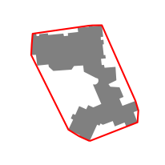
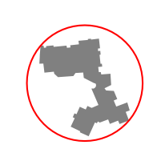
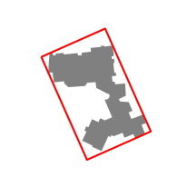
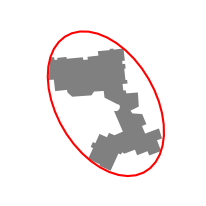

# Urban morphometry
## Generation of enclosing shapes
### Convex Hull
The **t4gpd** class named _ConvexHull_ is a wrapper for the Shapely [convex_hull](https://shapely.readthedocs.io/en/stable/manual.html?highlight=convex%20hull#object.convex_hull) method. To use it, the class name _ConvexHull_ must be passed as the first argument of the _STGeoProcess_ constructor as in the following example. The resulting _red_ object is a GeoPandas [GeoDataFrame](https://geopandas.org/docs/reference/api/geopandas.GeoDataFrame.html?highlight=geodataframe#geopandas.GeoDataFrame).

```python
from t4gpd.demos.GeoDataFrameDemos import GeoDataFrameDemos
from t4gpd.morph.geoProcesses.ConvexHull import ConvexHull
from t4gpd.morph.geoProcesses.STGeoProcess import STGeoProcess

building = GeoDataFrameDemos.singleBuildingInNantes()
red = STGeoProcess(ConvexHull, building).run()
```

The following code snippet allows to map these 2 [GeoDataFrame](https://geopandas.org/docs/reference/api/geopandas.GeoDataFrame.html?highlight=geodataframe#geopandas.GeoDataFrame).

```python
import matplotlib.pyplot as plt
_, basemap = plt.subplots(figsize=(0.25*8.26, 0.25*8.26))
building.plot(ax=basemap, color='grey')
red.boundary.plot(ax=basemap, color='red')
plt.axis('off')
plt.savefig('img/convex_hull.png')
```



### Minimum Bounding Circle
To determine the Minimum-area Bounding Circle, we implemented the Chrystal Algorithm. The **t4gpd** class with the name _MBC_ allows, as before, when it is passed as the first argument of the _STGeoProcess_ constructor to implement the corresponding mechanism.

```python
from t4gpd.demos.GeoDataFrameDemos import GeoDataFrameDemos
from t4gpd.morph.geoProcesses.MBC import MBC
from t4gpd.morph.geoProcesses.STGeoProcess import STGeoProcess

building = GeoDataFrameDemos.singleBuildingInNantes()
red = STGeoProcess(MBC, building).run()
```



### Minimum-area Bounding Rectangle
To determine the Minimum-area Bounding Rectangle, we wrapped the shapely method named [minimum_rotated_rectangle](https://shapely.readthedocs.io/en/latest/manual.html?highlight=minimum_rotated_rectangle#object.minimum_rotated_rectangle). To activate it, the _MABR_ class must be passed as the first argument of the _STGeoProcess_ constructor.

```python
from t4gpd.demos.GeoDataFrameDemos import GeoDataFrameDemos
from t4gpd.morph.geoProcesses.MABR import MABR
from t4gpd.morph.geoProcesses.STGeoProcess import STGeoProcess

building = GeoDataFrameDemos.singleBuildingInNantes()
red = STGeoProcess(MABR, building).run()
```


**Note**: Substituting the _MPBR_ class name to the _MABR_ one, allows to recover the Minimum-Perimeter Bounding Rectangle.

### Minimum-Area Bounding Ellipse
To determine the Minimum-Area Bounding Ellipse, we used the algorithm presented in (Leduc &amp; Leduc, 2020)[@Leduc2020]. To activate it, a _MABE_ instance must be passed as the first argument of the _STGeoProcess_ constructor. The threshold argument is an angular value in radians. It is used to prune the almost flat angles of the given geometries.

```python
from t4gpd.demos.GeoDataFrameDemos import GeoDataFrameDemos
from t4gpd.morph.geoProcesses.MABE import MABE
from t4gpd.morph.geoProcesses.STGeoProcess import STGeoProcess

building = GeoDataFrameDemos.singleBuildingInNantes()
red = STGeoProcess(MABE(npoints=40, threshold=None), building).run()
```



\bibliography

## Convexity indices
There are various convexity indices among which we have implemented:

  * The number of convex components. This dimensionless indicator corresponds to the number of concavities in the shape. In the resulting [GeoDataFrame](https://geopandas.org/docs/reference/api/geopandas.GeoDataFrame.html?highlight=geodataframe#geopandas.GeoDataFrame), the corresponding column is named _n_con_comp_.
  * The surface convexity defect. This indicator is dimensionless and standardized. It is equal to the ratio of the area of the shape to that of its convex hull. In the resulting [GeoDataFrame](https://geopandas.org/docs/reference/api/geopandas.GeoDataFrame.html?highlight=geodataframe#geopandas.GeoDataFrame), the corresponding column is named _a_conv_def_.
  * The perimeter convexity defect. In the resulting [GeoDataFrame](https://geopandas.org/docs/reference/api/geopandas.GeoDataFrame.html?highlight=geodataframe#geopandas.GeoDataFrame), the corresponding column is named _p_conv_def_.
  * 
  * 

```python
from t4gpd.demos.GeoDataFrameDemos import GeoDataFrameDemos
from t4gpd.morph.geoProcesses.ConvexityIndices import ConvexityIndices
from t4gpd.morph.geoProcesses.STGeoProcess import STGeoProcess

building = GeoDataFrameDemos.singleBuildingInNantes()

result = STGeoProcess(ConvexityIndices, building).run()
result = result[['n_con_comp', 'a_conv_def', 'p_conv_def', 'big_concav', 'small_conc']]
print(result) # 8, 58.9%, 65.0%, 152838.8, 6.0
```

## Circularity indices
```python
from t4gpd.demos.GeoDataFrameDemos import GeoDataFrameDemos
from t4gpd.morph.geoProcesses.CircularityIndices import CircularityIndices
from t4gpd.morph.geoProcesses.STGeoProcess import STGeoProcess

building = GeoDataFrameDemos.singleBuildingInNantes()

result = STGeoProcess(CircularityIndices, building).run()
result = result[['gravelius', 'jaggedness', 'miller', 'morton', 'a_circ_def']]
print(result) # 2.2, 61.5, 20.4%, 32.7%, 32.7%
```

## Rectangularity indices
```python
from t4gpd.demos.GeoDataFrameDemos import GeoDataFrameDemos
from t4gpd.morph.geoProcesses.RectangularityIndices import RectangularityIndices
from t4gpd.morph.geoProcesses.STGeoProcess import STGeoProcess

building = GeoDataFrameDemos.singleBuildingInNantes()

result = STGeoProcess(RectangularityIndices, building).run()
result = result[['stretching', 'a_rect_def', 'p_rect_def']]
print(result) # 62.0%, 51.2%, 73.3%
```

## Ellipticity indices
```python
from t4gpd.demos.GeoDataFrameDemos import GeoDataFrameDemos
from t4gpd.morph.geoProcesses.EllipticityIndices import EllipticityIndices
from t4gpd.morph.geoProcesses.STGeoProcess import STGeoProcess

building = GeoDataFrameDemos.singleBuildingInNantes()

result = STGeoProcess(EllipticityIndices(threshold=None), building).run()
result = result[['flattening', 'a_elli_def', 'p_elli_def']]
print(result) # 62.9%, 44.3%, 70.6%
```
