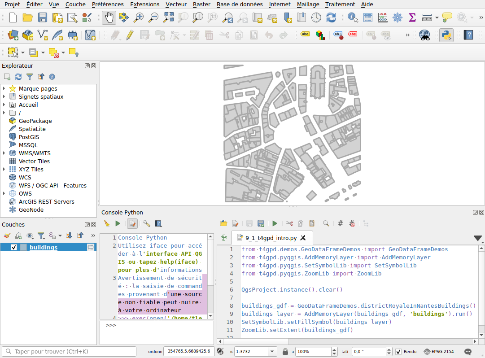

# Interfacing with QGIS (version 0.3.0+)

Provided you have correctly configured your QGIS instance[^1], you can
use the t4gpd plugin in the context of its Python console. Thus, the
*t4gpd.pyqgis.AddMemoryLayer* class allows you to transform a
GeoDataFrame into a
[*qgis.core.QgsVectorLayer*](https://qgis.org/pyqgis/master/core/QgsVectorLayer.html),
and then add this new layer to the current
[*qgis.core.QgsProject*](https://qgis.org/pyqgis/master/core/QgsProject.html)
instance.

[^1]: As exposed in [this
post](https://gisunchained.wordpress.com/2019/05/29/using-qgis-from-conda/),
we suggest that you install QGIS in the context of your conda
environment using the following command: ```conda install qgis```

```python
from t4gpd.demos.GeoDataFrameDemos import GeoDataFrameDemos
from t4gpd.pyqgis.AddMemoryLayer import AddMemoryLayer
from t4gpd.pyqgis.SetSymbolLib import SetSymbolLib
from t4gpd.pyqgis.ZoomLib import ZoomLib

QgsProject.instance().clear()

buildings_gdf = GeoDataFrameDemos.districtRoyaleInNantesBuildings()
buildings_layer = AddMemoryLayer(buildings_gdf, 'buildings').run()
SetSymbolLib.setFillSymbol(buildings_layer)
ZoomLib.setExtent(buildings_gdf)
```

The *t4gpd.pyqgis.SetSymbolLib* class provides a few static methods to
perform different symbologies on the loaded *QgsVectorLayer*. Finally,
the *t4gpd.pyqgis.ZoomLib* class is used to set the zoom range.


