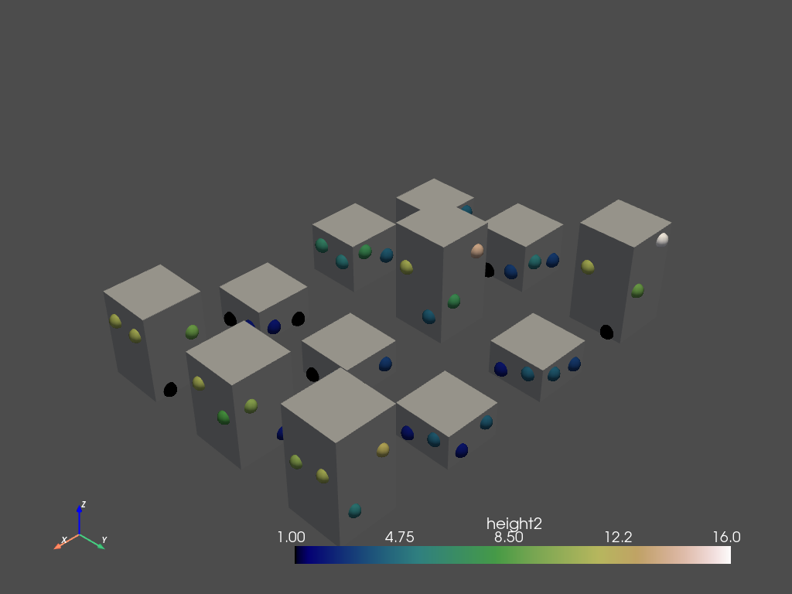
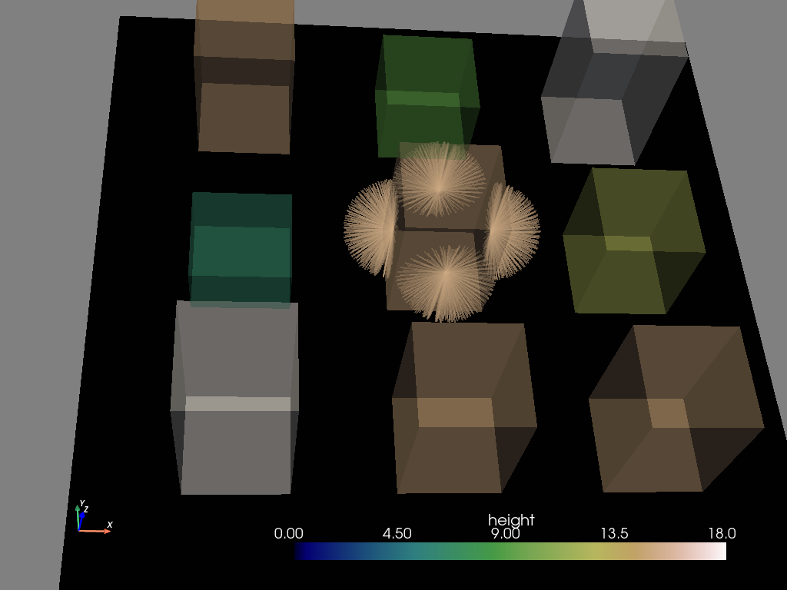
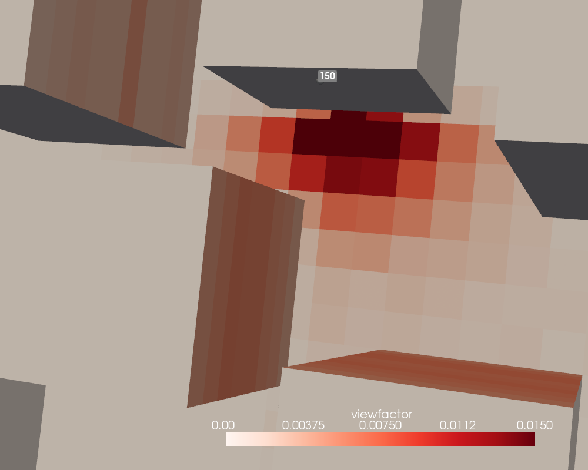

# Interfacing with PyVista and VTK 3D plotting (version 0.4.0+)

## Simple 3D display (version 0.4.0+)

As written on [docs.pyvista.org](https://docs.pyvista.org/), PyVista is "a 
high-level API to the [3D] Visualization Toolkit ([VTK](https://vtk.org/))". Provided you have installed it correctly (which conda does very well via a ```conda install pyvista```!), the following instructions allow you to switch from the traditional 2D geomatics environment to a 3D environment:

```python
from numpy.random import randint
from t4gpd.commons.GeomLib import GeomLib
from t4gpd.demos.GeoDataFrameDemos import GeoDataFrameDemos
from t4gpd.morph.geoProcesses.FootprintExtruder import FootprintExtruder
from t4gpd.morph.geoProcesses.STGeoProcess import STGeoProcess
from t4gpd.morph.STPointsDensifier2 import STPointsDensifier2
from t4gpd.pyvista.ToUnstructuredGrid import ToUnstructuredGrid

buildings = GeoDataFrameDemos.regularGridOfPlots(3, 4, dw=5.0)
buildings['n_floors'] = randint(2, 7, size=len(buildings))
buildings['height'] = 3.0 * buildings.n_floors

sensors = STPointsDensifier2(buildings, curvAbsc=[0.25, 0.75], pathidFieldname=None).run()
sensors['height2'] = sensors.height.apply(lambda h: randint(1.0, h - 1.0))
sensors['__TMP__'] = list(zip(sensors.geometry, sensors.height2))
sensors.geometry = sensors.__TMP__.apply(lambda t: GeomLib.forceZCoordinateToZ0(t[0], z0=t[1]))
sensors.drop(columns=['__TMP__'], inplace=True)

op = FootprintExtruder(buildings, 'height', forceZCoordToZero=True)
buildingsIn3d = STGeoProcess(op, buildings).run()

scene1 = ToUnstructuredGrid([buildingsIn3d, sensors], 'height2').run()
scene1.plot(scalars='height2', cmap='gist_earth', show_edges=False,
	show_scalar_bar=True, point_size=20.0, render_points_as_spheres=True,
	screenshot='pyvista_1.png')
```

As you may notice, the *t4gpd.pyvista.ToUnstructuredGrid* class provides a way to wrap a list of *GeoDataFrame*s before passing them to PyVista.



## 3D ray casting (version 0.4.0+)

The coupling to the [PyVista.org](https://docs.pyvista.org/) library allows a robust and powerful ray casting in a 3D urban model (a small test allows me to cast two million rays in 67 seconds).

To be able to cast these rays, let's start by building a (small) 3D model and anchoring some sensors in its facades:

```python
from geopandas import GeoDataFrame
from numpy.random import randint, seed
from shapely.geometry import box
from t4gpd.commons.GeomLib import GeomLib
from t4gpd.demos.GeoDataFrameDemos import GeoDataFrameDemos
from t4gpd.morph.geoProcesses.FootprintExtruder import FootprintExtruder
from t4gpd.morph.geoProcesses.STGeoProcess import STGeoProcess
from t4gpd.morph.STPointsDensifier2 import STPointsDensifier2

# Let's start by reseeding a BitGenerator
seed(0)

# Let's generate a set of building footprints
buildings = GeoDataFrameDemos.regularGridOfPlots(3, 3, dw=5.0)
buildings['n_floors'] = randint(2, 7, size=len(buildings))
buildings['height'] = 3.0 * buildings.n_floors

# Let's proceed to the extrusion of the building footprints
op = FootprintExtruder(buildings, 'height', forceZCoordToZero=True)
buildingsIn3d = STGeoProcess(op, buildings).run()

# Let's generate a ground surface to intercept the rays
ground = GeoDataFrame([{'geometry': box(*buildings.buffer(10).total_bounds), 'height': 0}])

# Let's anchor the sensors on the facades (at a distance of 1e-6 m from the facades)
d = 1e-6
sensors = STPointsDensifier2(buildings, [0.5], pathidFieldname='gid',
	distToTheSubstrate=d).run()
sensors['__TMP__'] = list(zip(sensors.geometry, sensors.height))
# Let's move the sensors from the ground to the floors
sensors.geometry = sensors.__TMP__.apply(lambda t: 
	GeomLib.forceZCoordinateToZ0(t[0], z0=t[1] / 2))
sensors.drop(columns=['__TMP__'], inplace=True)

# Let's select a subset of sensors to improve the readability of the 3D sketch.
sensors = sensors.loc[ sensors[sensors.gid==4].index ]
```

The model being built, let's proceed to the ray casting:

```python
from pyvista import global_theme, Sphere
from t4gpd.pyvista.geoProcesses.RayCasting3D import RayCasting3D

shootingDirs = Sphere(
	radius=1.0, center=(0, 0, 0), direction=(0, 0, 1),
	theta_resolution=20, phi_resolution=20).cell_centers().points

op = RayCasting3D([buildingsIn3d, ground], shootingDirs, viewpoints=sensors, 
	normalFieldname='normal_vec', mc=None, maxRayLen=5.0, showHitPoints=False)
rays = STGeoProcess(op, sensors).execute()
```

In the above code snippet, we arbitrarily decided to:

- limit the length of the rays to 5 m (parameter *maxRayLen*), 

- cast only half of the rays (those whose scalar product with the normal to the faces - parameter *normalFieldname* - is strictly positive),

- cast all the rays joining the sensor to the centroids of the sphere constructed by the instruction *shootingDirs = Sphere(...)* (the parameter *mc* - for Monte Carlo method - takes the value *None* or a value between 0 and 1 allowing to reduce the proportion of casted rays).

All that remains is to execute the following code snippet to produce a 3D representation:

```python
from t4gpd.pyvista.ToUnstructuredGrid import ToUnstructuredGrid

global_theme.background = 'grey'
global_theme.axes.show = True

scene = ToUnstructuredGrid([buildingsIn3d, ground, rays, sensors], 'height').run()
scene.plot(scalars='height', cmap='gist_earth', show_edges=False, cpos='xy',
	opacity=0.99, show_scalar_bar=True, point_size=15.0,
	render_points_as_spheres=True, line_width=2.0)
```



## Estimation of view factors using ray casting (version 0.4.0+)

The aim here is to estimate and represent the view factors associated with a sensor placed on the front of a building. Let's start by loading the urban model. We then separate the buildings from the ground surface by a simple filter on the value of the z component of the centroid.  This allows us to grid the ground surface before regrouping the whole model by concatenation.

```python
from pandas import concat, merge
from t4gpd.commons.GeomLib import GeomLib
from t4gpd.commons.GeomLib3D import GeomLib3D
from t4gpd.demos.GeoDataFrameDemos5 import GeoDataFrameDemos5
from t4gpd.morph.STGrid import STGrid
from t4gpd.morph.geoProcesses.STGeoProcess import STGeoProcess
from t4gpd.pyvista.geoProcesses.MoveSensorsAwayFromSurface import MoveSensorsAwayFromSurface

# Let's load a pre-registered 3D dataset
buildings = GeoDataFrameDemos5.cirSceneMasque1Corr()
buildings['height'] = buildings.geometry.apply(lambda g: GeomLib3D.centroid(g).z)

# Let's extract only the building surfaces
buildings2 = buildings.loc[ buildings[buildings['height'] > 0].index ]
buildings2.reset_index(inplace=True, drop=True)

# Let's extract the ground surface and grid it
ground = buildings.loc[ buildings[buildings['height'] == 0].index ]
ground.reset_index(inplace=True, drop=True)
groundGrid = STGrid(ground, dx=4, dy=None, indoor=True, intoPoint=False).run()
groundGrid.geometry = groundGrid.geometry.apply(
	lambda g: GeomLib.forceZCoordinateToZ0(g, z0=0.0))
groundGrid['normal_vec'] = groundGrid.gid.apply(lambda _: [0,0,1])
groundGrid['height'] = 0

# Let's group these two sets of faces by concatenation
masks = concat([buildings2, groundGrid[['geometry', 'normal_vec', 'height']]])
masks.reset_index(inplace=True, drop=True)

# Be careful, the pk attribute must be unique (it is a primary key to use 
# the Relational Databases terminology)
masks['pk'] = masks.index

# Let's deploy the sensors
sensors = masks.copy(deep=True)
sensors.geometry = sensors.geometry.apply(lambda g: GeomLib3D.centroid(g))
op = MoveSensorsAwayFromSurface(sensors, normalFieldname='normal_vec', dist=1e-6)
sensors = STGeoProcess(op, sensors).execute()

# Let's select the only sensor of number 150
sensors = sensors.loc[ sensors[sensors.pk == 150].index ]
```

The model being built, let's proceed to the ray casting:

```python
from t4gpd.pyvista.commons.RayCasting3DLib import RayCasting3DLib
from t4gpd.pyvista.geoProcesses.RayCasting3D import RayCasting3D
from t4gpd.pyvista.STRaysToViewFactors import STRaysToViewFactors

# Let's prepare a set of 10,000 uniformly distributed rays
shootingDirs = RayCasting3DLib.preparePanopticRays(nrays=10000)

# Let's cast the already prepared rays
op = RayCasting3D([masks], shootingDirs, viewpoints=sensors,
                  normalFieldname='normal_vec', pkFieldname='pk')
rays = STGeoProcess(op, sensors).execute()

# Let's convert the DataFrame of rays into a sparse matrix of view factors
vfSparseMatrix = STRaysToViewFactors(rays, 'pk', 'hitGids').run()

# Let's assign these view factors to each face of the model by means of an attribute join
masks2 = merge(masks, vfSparseMatrix[['dst', 'viewfactor']], how='left', 
	left_on='pk', right_on='dst')
masks2.viewfactor = masks2.viewfactor.fillna(value=0)
```

It remains then to display the results:

```python
from pyvista import global_theme, Plotter, Sphere
from t4gpd.pyvista.ToUnstructuredGrid import ToUnstructuredGrid

# The positions stored in the centroids list will allow us to display the 
# number 150 sensor label in the right place
centroids = sensors.geometry.apply(lambda g: g.coords[0]).to_list()
scene = ToUnstructuredGrid([masks2, sensors], 'viewfactor').run()

global_theme.background = 'grey'
global_theme.axes.show = True

plotter = Plotter(window_size=(1000, 800))
# To improve the readability of the rendering we limit the color range using 'clim'
plotter.add_mesh(scene, scalars='viewfactor', cmap='reds', show_edges=False,
    show_scalar_bar=True, point_size=15.0, clim=[0,0.015], 
    render_points_as_spheres=True)
plotter.add_point_labels(centroids, sensors.pk.to_list(), font_size=16, point_size=1)
plotter.camera_position = 'xy'
plotter.show()
```


