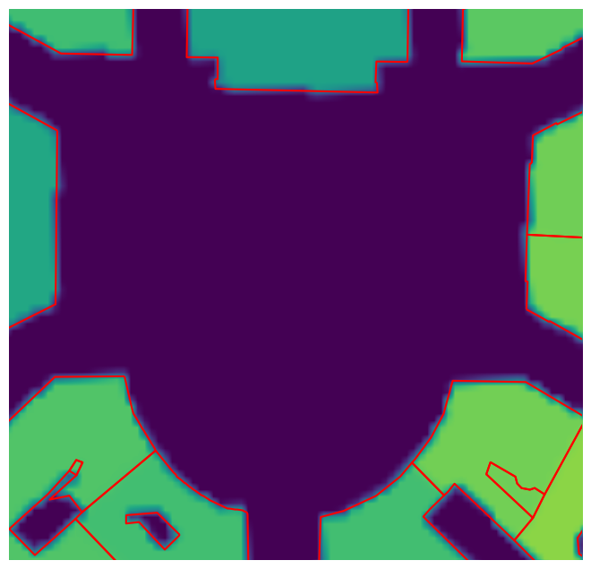
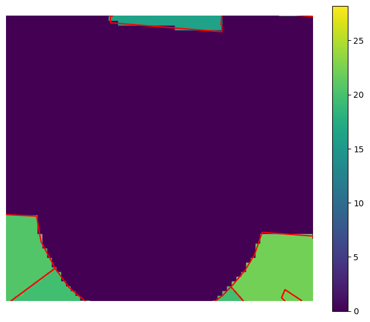

# Processing raster data

Let's start by creating a flat digital terrain model. Save it in a temporary file.

```python
from numpy import zeros
from t4gpd.demos.GeoDataFrameDemos import GeoDataFrameDemos
from t4gpd.morph.STBBox import STBBox
from t4gpd.raster.RTFromArrayToRaster import RTFromArrayToRaster
from t4gpd.raster.RTToFile import RTToFile

buildings = GeoDataFrameDemos.districtGraslinInNantesBuildings()
roi = STBBox(buildings, buffDist=0).run()
array = zeros([400, 340])

dtm = RTFromArrayToRaster(array, roi).run()
RTToFile(dtm, "/tmp/dtm.tif").run()
```

Let's then rasterize the buildings layer to obtain a digital surface model.

```python
from t4gpd.raster.STRasterize import STRasterize

dsm = STRasterize(buildings, dtm, attr="HAUTEUR").run()
RTToFile(dsm, "/tmp/dsm.tif").run()
```

Let's add these digital models pixel by pixel to produce the digital elevation model.

```python
dem = dtm.read(1) + dsm.read(1)
dem = RTFromArrayToRaster(dem, roi).run()
RTToFile(dem, "/tmp/dem.tif").run()
```

Finally, let's display the result.

```python
import matplotlib.pyplot as plt
import contextily as ctx

buildings2 = buildings.to_crs("epsg:3857")
minx, miny, maxx, maxy = GeoDataFrameDemos.squaresInNantes(
    "Graslin").buffer(5.0).to_crs("epsg:3857").total_bounds

fig, ax = plt.subplots(figsize=(1 * 8.26, 1 * 8.26))
buildings2.boundary.plot(ax=ax, color="red")
ctx.add_basemap(ax, crs=buildings2.crs, source="/tmp/dem.tif", cmap="viridis")
ax.axis("off")
ax.axis([minx, maxx, miny, maxy])
plt.savefig("img/raster1.png", bbox_inches="tight")
```

{width=300}

## How to transform a raster into a GeoDataFrame of shapely Points

This involves using the *t4gpd.raster.RTVectorize* class:

```python
from t4gpd.raster.RTLoad import RTLoad
from t4gpd.raster.RTVectorize import RTVectorize

dem = RTLoad("/tmp/dem.tif").run()
points = RTVectorize(dem).run()
```

Finally, let's display the result.

```python
import matplotlib.pyplot as plt
import contextily as ctx

minx, miny, maxx, maxy = GeoDataFrameDemos.squaresInNantes(
    "Graslin").buffer(-5.0).total_bounds

fig, ax = plt.subplots(figsize=(1 * 8.26, 1 * 8.26))
buildings.boundary.plot(ax=ax, color="red")
points.plot(ax=ax, column="pix_value", legend=True, legend_kwds={"shrink": 0.8})
ax.axis("off")
ax.axis([minx, maxx, miny, maxy])
plt.savefig("img/raster2.png", bbox_inches="tight")
```

{width=300}
