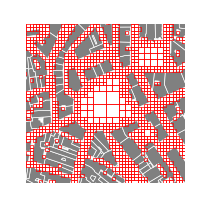

# Deployment of virtual sensors
## Along urban routes

The objective here is to learn how to sample a linear path using the
*t4gpd.morph.STPointsDensifier* class. Its constructor has 5
arguments: the first one corresponds to the name of the GeoDataFrame
to sample, the second one corresponds to the value of the sampling
step, the last three are optional.

> `STPointsDensifier(gdf, distance, pathidFieldname=None, adjustableDist=True, removeDuplicate=True)`

```python
from t4gpd.demos.GeoDataFrameDemos import GeoDataFrameDemos
from t4gpd.morph.STPointsDensifier import STPointsDensifier

pathways = GeoDataFrameDemos.districtRoyaleInNantesPaths()
pathways = pathways[ pathways.gid == 2 ]

sensors = STPointsDensifier(pathways, distance=45.0,
	pathidFieldname=None, adjustableDist=True, 
	removeDuplicate=False).run()
```

To map it via matplotlib, proceed as follows:

```python
import matplotlib.pyplot as plt

_, basemap = plt.subplots(figsize=(0.25*8.26, 0.25*8.26))
buildings.plot(ax=basemap, color='grey', edgecolor='white', linewidth=0.5)
pathways.plot(ax=basemap, color='black', linewidth=0.5)
sensors.plot(ax=basemap, color='red', marker='P')
plt.axis('off')
plt.savefig('img/demo4.png')
```

*Note:* This mapping presupposes that you have already [loaded the
 building
 footprints](introduction.md#loading-a-set-of-buildings-and-roads).


## On the vertices of a grid

Gridding is a well-known spatial sampling technique. To grid a study
space, *t4gpd* provides the geoprocessing name *t4gpd.morph.STGrid*.

> `STGrid(gdf, dx, dy=None, indoor=None, intoPoint=True, encode=True)`

```python
from t4gpd.demos.GeoDataFrameDemos import GeoDataFrameDemos
from t4gpd.morph.STGrid import STGrid

buildings = GeoDataFrameDemos.districtRoyaleInNantesBuildings()

sensors = STGrid(buildings, dx=20, dy=None, indoor=False, intoPoint=True).run()
```

To map it via matplotlib, proceed as follows:

```python
import matplotlib.pyplot as plt
from shapely.geometry import box

minx, miny, maxx, maxy = box(*buildings.total_bounds).buffer(-50).bounds

_, basemap = plt.subplots(figsize=(0.25*8.26, 0.25*8.26))
buildings.plot(ax=basemap, color='grey', edgecolor='white', linewidth=0.5)
sensors.plot(ax=basemap, color='red', marker='+')

basemap.axis([minx, maxx, miny, maxy])
plt.axis('off')
plt.savefig('img/demo5.png')
```


## Along the skeleton of the urban open space

The aim here is to use the virtual sensor positioning strategy
presented in [(Rodler &amp; Leduc,
2019)](https://doi.org/10.1016/j.uclim.2019.100457){target=_blank}. The first step is
therefore to determine the skeleton of the open space using the
following geoprocessing:

> `STSkeletonizeTheVoid(gdf, samplingDist=10.0)`

The constructor of this class has two arguments. The first is the
GeoDataFrame of the building footprints and the second is the sampling
distance between two consecutive points located on the building
contours. These points are used in the tessellation process. Once the
skeleton of the open space is obtained, it only remains to sample it
in a set of points with the [previously mentioned
geoprocessing](#along-urban-routes):

> `STPointsDensifier(gdf, distance, pathidFieldname=None, adjustableDist=True, removeDuplicate=True)`

The following code snippet summarizes the entire process:

```python
from t4gpd.demos.GeoDataFrameDemos import GeoDataFrameDemos
from t4gpd.morph.STPointsDensifier import STPointsDensifier
from t4gpd.morph.STSkeletonizeTheVoid import STSkeletonizeTheVoid

buildings = GeoDataFrameDemos.districtRoyaleInNantesBuildings()

skeleton = STSkeletonizeTheVoid(buildings, samplingDist=5.0).run()

sensors = STPointsDensifier(skeleton, distance=15.0, 
	adjustableDist=True, removeDuplicate=False).run()
```

To map it via matplotlib, proceed as follows:

```python
import matplotlib.pyplot as plt
from shapely.geometry import box

minx, miny, maxx, maxy = box(*buildings.total_bounds).buffer(-70).bounds

_, basemap = plt.subplots(figsize=(0.25*8.26, 0.25*8.26))
buildings.plot(ax=basemap, color='grey', edgecolor='white', linewidth=0.5)
skeleton.plot(ax=basemap, color='black', linewidth=0.5)
sensors.plot(ax=basemap, color='red', marker='.')

basemap.axis([minx, maxx, miny, maxy])
plt.axis('off')
plt.savefig('img/demo6.png')
```


## Meshing of the urban space

### Grid the region of interest

Gridding is a well-known spatial sampling technique. To grid a study
space, *t4gpd* provides the geoprocessing name *t4gpd.morph.STGrid*.

> `STGrid(gdf, dx, dy=None, indoor=None, intoPoint=False, encode=True)`

If you want to grid the region of interest proceed as follows:

```python
from t4gpd.demos.GeoDataFrameDemos import GeoDataFrameDemos
from t4gpd.morph.STGrid import STGrid

buildings = GeoDataFrameDemos.districtRoyaleInNantesBuildings()

grid = STGrid(buildings, dx=20, dy=None, indoor=None, intoPoint=False).run()
```

To map the resulting grid via matplotlib, proceed as follows:

```python
import matplotlib.pyplot as plt
from shapely.geometry import box

minx, miny, maxx, maxy = box(*buildings.total_bounds).buffer(-50).bounds

_, basemap = plt.subplots(figsize=(0.25*8.26, 0.25*8.26))
buildings.plot(ax=basemap, color='grey', edgecolor='white', linewidth=0.5)
grid.boundary.plot(ax=basemap, color='red', linewidth=0.5)

basemap.axis([minx, maxx, miny, maxy])
plt.axis('off')
plt.savefig('img/demo7.png')
```


### How to build a Triangulated irregular network (TIN)

The mesh we will produce here assumes that you have installed the
[GMSH three-dimensional finite element mesh
generator](https://gmsh.info/){target=_blank}. The class
*t4gpd.morph.GmshTriangulator* is a wrapper that encapsulates an
export to GMSH/Geo format, a call to the GMSH mesher and an import of
the GMSH/MSH file format result.

> `GmshTriangulator(gdf, characteristicLength=10.0, gmsh=None)`

As you can see from the following code snippet, the *gmsh* argument of
the *GmshTriangulator* command is used to specify the location of the
GMSH executable.

```python
from t4gpd.demos.GeoDataFrameDemos import GeoDataFrameDemos
from t4gpd.morph.GmshTriangulator import GmshTriangulator

building = GeoDataFrameDemos.singleBuildingInNantes()
tin = GmshTriangulator(building, characteristicLength=15.0,
	gmsh='/usr/bin/gmsh').run()
```

To map the resulting mesh via matplotlib, proceed as follows:

```python
import matplotlib.pyplot as plt

_, basemap = plt.subplots(figsize=(0.25*8.26, 0.25*8.26))
building.plot(ax=basemap, color='grey', edgecolor='white', linewidth=0.5)
tin.boundary.plot(ax=basemap, color='red', linewidth=0.25)

plt.axis('off')
plt.savefig('img/demo8.png')
```



## How to snap points on line?

There are two distinct possibilities, either via the
*t4gpd.morph.STSnappingPointsOnLines* class, or via the
*t4gpd.morph.STSnappingPointsOnLines2* class.

<!--
To implement the *STSnappingPointsOnLines* class, let's start by
sampling an urban route [as we did before](#along-urban-routes):

```python
from t4gpd.demos.GeoDataFrameDemos import GeoDataFrameDemos
from t4gpd.morph.STPointsDensifier import STPointsDensifier

pathways = GeoDataFrameDemos.districtRoyaleInNantesPaths()
pathways = pathways.loc[ pathways[pathways.gid == 2].index ]

sensors = STPointsDensifier(pathways, distance=45.0,
	pathidFieldname=None, adjustableDist=True, 
	removeDuplicate=False).run()
```


Let us then pseudo-randomly perturb the position of the various points resulting from the sampling.

```python
from random import choice, random, seed
from shapely.geometry import Point

seed(1)
radii = [-20.0, 20.0]
sensors.geometry = sensors.geometry.apply(
    lambda g: Point(g.x + choice(radii) * random(), g.y + choice(radii) * random()))
```

As a result of this disturbance, the sample points are no longer
snapped to the trajectory. Let's use the *STSnappingPointsOnLines*
class:

```python
from t4gpd.morph.STSnappingPointsOnLines import STSnappingPointsOnLines
STSnappingPointsOnLines(sensors, pathways).run()
```

To map it via matplotlib, proceed as follows:

```python
import matplotlib.pyplot as plt

_, basemap = plt.subplots(figsize=(0.25*8.26, 0.25*8.26))
pathways.plot(ax=basemap, color='black', linewidth=0.5)
sensors.plot(ax=basemap, color='red', marker='P')
plt.axis('off')
plt.show()
plt.savefig('img/demo4.png')
```
-->
